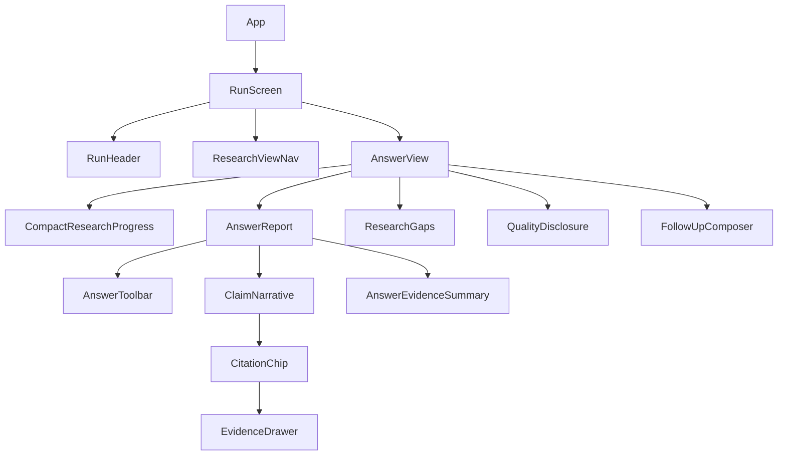

# ARES V3 Answering UI/UX Implementation Plan

> **Recommended repository path:** `docs/v3/V3_ANSWERING_UI_UX_IMPLEMENTATION_PLAN.md`  
> **Repository reviewed:** `aman-bhaskar-codes/ARES`  
> **Planning baseline:** `v3-development` at `4cdc2d43b97313e08059c93a1ad516003d8f2338`  
> **V2 baseline:** ARES `0.11.0`, schema head `0012_visual_artifacts`  
> **Plan scope:** the research **answering experience** and closely coupled evidence-navigation UX. This is not a backend/RAG rewrite.
>
> **For agentic workers:** implement this plan task-by-task. Prefer a dedicated feature branch and small reviewable commits. Preserve the V2 evidence/security contracts at every step.

---

## 0. Executive decision

ARES already has the difficult engineering foundations that many research UIs lack: durable research runs, stable deep links, claim-to-evidence lineage, exact source locators, multimodal evidence previews, support states, source filters, visualizations, activity replay, exports, light/dark themes, and explicit security boundaries.

The V3 UI work should therefore **not rebuild the product shell or add another framework**. It should make the existing capabilities feel like one coherent, modern research-report experience.

The main redesign principle is:

> **The answer is the primary reading surface; evidence is always one interaction away; diagnostics are progressively disclosed; uncertainty stays visible without repeating the answer.**

The most important current problem is concrete, not subjective: the backend builds `AnswerBlock.markdown` from the finalized claim texts, while `Answer.tsx` renders that markdown and then renders the same claims again as an audit list. The result is a duplicated answer. Fixing this presentation model is the highest-value first change.

### Recommended release boundary

The first V3 answer-experience release should be considered complete when:

- the normal finalized answer no longer repeats claim text;
- citations remain exact, stable, keyboard accessible, and open the existing evidence inspector;
- supported/partial/conflicting/insufficient states are understandable without turning every paragraph into a diagnostic card;
- run quality, gaps, exports, progress, and follow-up actions are organized around the answer instead of competing with it;
- desktop, tablet, mobile, 320 CSS px reflow, 200% zoom, reduced motion, keyboard-only use, and light/dark themes pass;
- heavy PDF, ECharts, and React Flow code remains lazy and does not move into the critical answer bundle;
- no backend schema migration and no second evidence store are introduced.

---

# 1. Inputs reviewed

## 1.1 GitHub source of truth

The current repository structure was inspected directly on GitHub. The implementation should work from the current `v3-development` branch rather than from an older ZIP.

Important current frontend files include:

- `apps/web/src/app/App.tsx`
- `apps/web/src/features/research/Answer.tsx`
- `apps/web/src/features/research/Composer.tsx`
- `apps/web/src/features/research/EvidenceDrawer.tsx`
- `apps/web/src/features/research/EvidenceIndex.tsx`
- `apps/web/src/features/research/ResearchActivity.tsx`
- `apps/web/src/features/research/RunQualityPanel.tsx`
- `apps/web/src/features/research/SafeMarkdown.tsx`
- `apps/web/src/features/research/VisualizationWorkspace.tsx`
- `apps/web/src/lib/researchRoutes.ts`
- `apps/web/src/styles.css`
- `DESIGN.md`

Relevant backend evidence/answer contracts were also inspected:

- `backend/src/ares/domain/models.py`
- `backend/src/ares/application/finalization.py`
- `backend/src/ares/application/engine.py`
- `backend/src/ares/application/repository.py`

## 1.2 Plugin/context checks

The planning workflow also checked the connected design/documentation tools:

- **Figma:** the connected account is available, but no ARES Figma file/node was supplied for this task. Do not invent a Figma source of truth. The plan includes a code-to-Figma reconciliation workflow for later.
- **Notion:** no ARES page was found in the connected workspace search, so no hidden Notion product requirements are assumed.
- **Miro:** no board matching ARES was found, so no Miro journey map is treated as authoritative.
- **GitBook:** no organization/site was exposed by the current connection, so GitBook is not an implementation dependency.
- **Production RAG / GenAI guidance:** applied to preserve the retrieval/generation/evidence boundary and avoid UI changes that imply unsupported confidence.
- **Superpowers / GodPrompt engineering guidance:** applied to keep the redesign incremental, testable, reversible, and tied to exact files/contracts.

GitHub therefore remains the authoritative implementation source for this plan.

---

# 2. Current-state UX diagnosis

## 2.1 What is already strong

Do not redesign these strengths away:

1. **Stable research URLs.** Conversation, run, view, and evidence deep links are already explicit.
2. **Real evidence lineage.** Citation labels resolve to evidence IDs and exact source locators.
3. **Evidence inspection.** PDF regions, image regions, table cells, audio/video timestamps, and sampled frames already have useful previews.
4. **Safe rendering.** `SafeMarkdown` allows normal Markdown/GFM without raw HTML execution and rejects dangerous URL schemes.
5. **User-safe progress.** `ResearchActivity` exposes operational progress without chain-of-thought.
6. **Honest quality states.** Supported, partially supported, conflicting, and insufficient-evidence states already exist.
7. **Useful separate workspaces.** Sources, Compare, and Activity are already stable views.
8. **Dark/reduced-motion support.** Existing semantic theme variables and reduced-motion behavior should be extended rather than replaced.
9. **No duplicate evidence database.** Visualizations and other projections share the same evidence lineage.

## 2.2 Highest-priority UX problems

### P0 — duplicated final answer

Current flow:

```text
Finalized claims
      ↓
compose_checked_markdown(claims)
      ↓
AnswerBlock.markdown
      ↓
Answer.tsx renders markdown
      ↓
Answer.tsx renders the same AnswerBlock.claims again
```

This produces a report followed by an audit copy of the same content.

**Required fix:** introduce one canonical visible narrative. Claims remain the provenance-bearing data structure, but the user should read each claim only once.

### P0 — answer hierarchy competes with diagnostics

Immediately after the answer, the UI can show export controls, a large Run Quality panel, gaps, errors, and the sticky composer. The answer should dominate visually; diagnostics should be accessible without feeling like a second dashboard.

### P0 — evidence metadata is front-loaded

The evidence drawer is technically rich, but fields such as provider, extraction method, hash, offsets, capture time, and document version appear with equal visual weight to the evidence itself.

**Required fix:** evidence text/original-source context first; technical provenance under a disclosure.

### P1 — microcopy and metadata are too small

Several current control/status styles use 8–10 px type. This is workable in a dense engineering console, but not ideal for a polished research product.

**Required fix:** raise critical metadata and control text sizes while keeping the editorial density.

### P1 — the answer view lacks a compact evidence summary

Users can inspect full diagnostics, but there is no concise summary such as:

```text
8 cited evidence passages · 5 source groups
6 supported · 1 partly supported · 1 conflict
```

This can be generated from existing server data without inventing a confidence score.

### P1 — progress and final report feel like different products

The activity card is useful, but the transition from “ARES is researching” to final answer can be more stable and less visually abrupt.

### P1 — sources list is evidence-span oriented rather than source oriented

The Sources view is excellent for inspection but can become repetitive when many evidence spans come from the same source.

### P2 — large `App.tsx` and monolithic CSS slow safe iteration

`App.tsx` owns too many UI responsibilities, and `styles.css` contains the entire product history. This does not require an architecture rewrite, but the answer redesign should create clearer frontend boundaries.

---

# 3. Product principles for the V3 answer experience

These are implementation constraints, not optional style preferences.

## 3.1 Evidence-first, not score-first

Never add an invented “confidence score”, “trust score”, or percentage that is not a defined server metric.

Use the actual states already available:

- supported;
- partially supported;
- conflicting;
- insufficient evidence;
- semantic support not yet established.

A citation count is not a correctness score. A citation existing is not proof that the cited evidence supports a claim.

## 3.2 One claim, one visible narrative occurrence

A finalized claim must not appear once in `markdown` and again in the claim audit list.

The frontend may show the same claim in an explicit export/technical inspector only when the user intentionally opens that secondary surface.

## 3.3 No client-side rewriting of research content

The client may:

- reorder **UI controls**;
- summarize counts;
- group source cards;
- choose presentation components;
- attach server-provided citations/statuses.

The client must not:

- rewrite claim text;
- synthesize new factual statements;
- infer evidence relations;
- merge conflicting claims into a new conclusion;
- manufacture source dates;
- convert a quality metric into a confidence label.

## 3.4 Progressive disclosure

Primary layer:

```text
Question
Research state
Answer
Inline citations
Important uncertainty
Follow-up
```

Secondary layer:

```text
Sources
Evidence inspector
Compact support summary
Exports
```

Expert/diagnostic layer:

```text
Quality metrics
Facet coverage
Evidence relations
Provider/extraction/hash details
Activity event log
```

## 3.5 Research instrument, not marketing dashboard

Continue the existing design language from `DESIGN.md`:

- restrained surfaces;
- editorial reading area;
- teal for navigation/evidence actions;
- amber for focus/evidence-region emphasis;
- shadows only where elevation has meaning;
- Georgia only for high-value reading moments;
- no decorative data-card explosion.

---

# 4. Target information architecture

## 4.1 Desktop

Keep the established shell:

```text
┌──────────────┬─────────────────────────────────────┬───────────────────┐
│ Left rail    │ Main research report                │ Evidence inspector│
│              │                                     │ when opened       │
│ New research │ Question / run metadata             │                   │
│ Threads      │ Research view navigation            │ Source identity   │
│ Documents    │                                     │ Cited passage     │
│ System       │ Answer                              │ Original preview  │
│              │  claim + [1][2]                     │                   │
│              │  claim + [3]                        │ Provenance        │
│              │                                     │ disclosure        │
│              │ Evidence summary                    │                   │
│              │ Uncertainty / gaps                  │ Open original     │
│              │                                     │                   │
│              │ sticky follow-up composer           │                   │
└──────────────┴─────────────────────────────────────┴───────────────────┘
```

The main report remains centered and readable. Do not expand prose across the full viewport just because the right drawer is closed.

Recommended layout targets:

```css
--shell-nav-width: 252px;
--report-max-width: 860px;
--reading-max-width: 72ch;
--evidence-drawer-width: 460px;
--topbar-height: 62px;
```

These are design targets, not reasons to break existing responsive behavior.

## 4.2 Tablet

At intermediate widths:

- keep the report centered;
- evidence inspector becomes an overlay drawer;
- research-view navigation remains horizontal and scrollable if required;
- follow-up composer remains within the report width;
- filters wrap cleanly.

## 4.3 Mobile

At mobile width:

- one content column;
- no persistent right-side panel;
- evidence opens as a full-height sheet/dialog;
- source filters collapse into a clear filter control or stacked panel;
- composer respects `env(safe-area-inset-bottom)`;
- action text is not truncated into ambiguous icons;
- long code/tables/visualizations may scroll internally, but the page itself should not require two-dimensional scrolling.

---

# 5. The new Answer view

## 5.1 Recommended component tree



Do not create all of these only to satisfy a diagram. Each extracted component must own a real, independently understandable responsibility.

## 5.2 Canonical answer rendering rule

Create a pure helper layer:

`apps/web/src/features/research/answerPresentation.ts`

Recommended interfaces:

```ts
export type AnswerPresentationMode = 'claim_narrative' | 'rich_markdown' | 'empty'

export interface AnswerSupportSummary {
  total: number
  supported: number
  partiallySupported: number
  conflicting: number
  insufficient: number
  semanticUnassessed: number
}

export function answerPresentationMode(block: AnswerBlock): AnswerPresentationMode

export function summarizeAnswerSupport(claims: AnswerClaim[]): AnswerSupportSummary

export function buildCitedAnswerText(block: AnswerBlock): string
```

### Decision logic

Use `claim_narrative` when the finalized markdown is effectively the generated “Evidence-checked answer” wrapper plus the same claim texts.

Use `rich_markdown` when the block contains genuine additional structure that is not a mirror of the claim list. This preserves compatibility with future/legacy blocks containing meaningful Markdown.

Use `empty` when neither usable claims nor usable Markdown exist.

The mirror test must normalize only presentation noise:

- the generated heading;
- surrounding whitespace;
- repeated blank lines;
- conservative Markdown punctuation normalization if needed.

It must **not** perform fuzzy semantic matching. If equality is uncertain, prefer `rich_markdown` and avoid silently discarding content.

## 5.3 Claim narrative design

For a normal supported claim:

```text
Claim text continues naturally in report typography. [1] [2]
```

Do not show a large “Supported” badge before every normal paragraph.

For exceptional states:

```text
PARTLY SUPPORTED
Claim text... [3]

SOURCES DISAGREE
Claim text... [4] [5]

EVIDENCE INCOMPLETE
Claim text... [6]
```

The status must be textual/iconographic, not color-only.

### Visual treatment

- default supported claim: normal paragraph, no card chrome;
- partial/conflict/insufficient: subtle left rule or compact status row;
- paragraph width: keep `72ch` maximum;
- body: 16 px mobile, approximately 17 px desktop;
- line height: approximately 1.65–1.75;
- claim gap: approximately 14–18 px;
- citations stay attached to the claim they support.

## 5.4 Citation chips

Create:

`apps/web/src/features/research/CitationChip.tsx`

Recommended props:

```ts
interface CitationChipProps {
  label: number
  evidenceId: string
  sourceTitle?: string
  sourceDomain?: string
  onOpen: (evidenceId: string, trigger?: HTMLElement) => void
}
```

Required behavior:

- label remains the exact server-assigned citation number;
- button activation opens the exact existing evidence ID;
- `aria-label` includes useful source context when available;
- keyboard activation works with Enter/Space;
- focus state remains highly visible;
- touch target should be larger than the painted citation square through padding/line box where practical;
- no new client-generated source numbering.

### Hover preview

Do **not** make hover preview a Phase-1 requirement.

It can be added later as progressive enhancement after the click/focus experience is stable. Mobile and keyboard behavior must never depend on hover.

---

# 6. Answer toolbar

Replace the current minimal “Answer / Copy” toolbar with a compact report toolbar.

Recommended information:

Left:

```text
Answer
Final / Partial
```

Right:

```text
Copy
Sources
Export
```

Avoid crowding.

## 6.1 Copy semantics

Current copy combines `block.markdown` plus the claims, so the clipboard can duplicate the answer just like the page.

`buildCitedAnswerText(block)` should produce one coherent plain-text representation:

```text
Claim one. [1][2]

Claim two. [3]
```

The clipboard must preserve citation labels without duplicating the content.

## 6.2 Export

Keep server-authorized export behavior.

Do not reimplement exports in the browser.

For the initial V3 answer redesign, the existing Markdown and JSON-manifest export endpoints remain canonical.

If Word/PDF export is desired later, design it as a backend export capability with the same authorization/provenance guarantees rather than browser print hacks.

---

# 7. Compact evidence/support summary

Create:

`apps/web/src/features/research/AnswerEvidenceSummary.tsx`

This component should answer:

> “How well-supported is this answer, and how much evidence was used?”

without inventing a score.

Example:

```text
Evidence used
8 evidence passages · 5 distinct sources

6 supported
1 partly supported
1 sources disagree
0 insufficient
```

Inputs can come from:

- `block.claims`;
- `block.citations`;
- already-fetched `runEvidence`;
- `run.gaps`.

No new endpoint is necessary.

If `runEvidence` has not loaded yet, show only facts already known from the block. Do not block answer rendering on the source count.

### Distinct sources

Count by stable server-provided source identity, not title text.

### Interaction

A “Review sources” control should switch to the existing Sources view.

A “Review conflict” action can open the first conflicting claim’s citation only if the mapping is explicit. Do not infer a conflicting source relation on the client.

---

# 8. Gaps and uncertainty

Current `run.gaps` are valuable but visually secondary.

Create or refactor:

`apps/web/src/features/research/ResearchGaps.tsx`

Preferred copy:

```text
What remains uncertain
```

rather than “error” styling.

Display gaps after the main narrative and before advanced diagnostics.

Behavior:

- one or two gaps: visible compact panel;
- many gaps: first few visible with “Show all”;
- no gaps: render nothing;
- partial run: gap section should be more prominent;
- failed/cancelled runs continue to use explicit operational state components.

Do not allow “no gaps” to imply “fully correct”.

---

# 9. Research progress UX

Refactor the existing `ResearchActivity` presentation rather than replacing the underlying event stream.

Recommended split:

- `CompactResearchProgress.tsx` — visible while run is non-terminal;
- existing/dedicated detailed activity log — Activity view.

Compact progress should show:

```text
ARES is researching
Reading sources

12 found · 7 read · 19 evidence passages

Planning — Sources — Reading — Evidence — Checking — Writing
```

Do not display internal model scratch text or chain-of-thought.

## 9.1 Stability

Reserve enough vertical space that stage changes do not cause severe layout jumping.

When a validated answer block appears, the answer area may render below the compact progress while the run completes, but the progress component should retain a stable position until terminal state.

## 9.2 Degraded states

Existing safe events such as:

- `discovery.track_failed`;
- `semantic_checker.degraded`;
- `semantic_checker.skipped`;
- `provider.backoff`;

should remain available in Activity.

The compact progress UI should summarize them only when they materially affect the result:

```text
1 research step degraded
```

and link to Activity.

---

# 10. Follow-up composer

The existing follow-up interaction is already conceptually correct. Improve its hierarchy and context.

Create a thin wrapper:

`apps/web/src/features/research/FollowUpComposer.tsx`

Keep `Composer.tsx` as the input engine.

## 10.1 Context-aware placeholder

Home:

```text
Ask a question worth tracing back to evidence…
```

Inside an existing run:

```text
Ask a follow-up about this research…
```

## 10.2 Context chips

Immediately above or within the follow-up composer, show compact editable context:

```text
Research
Web + Academic
2 documents
```

These are not decorative tags; clicking the appropriate context should expose the existing controls.

## 10.3 Sticky behavior

Desktop:

- sticky within the report column;
- subtle elevated surface;
- do not cover the last paragraph;
- maintain sufficient bottom padding in the document.

Mobile:

```css
bottom: calc(8px + env(safe-area-inset-bottom));
```

Ensure focused textarea is not obscured by the composer itself or another sticky control.

---

# 11. Evidence inspector redesign

The evidence inspector is one of ARES’s strongest differentiators. The redesign should make it easier to understand before exposing forensic details.

## 11.1 New order

Recommended drawer hierarchy:

1. **Source identity**
   - source title;
   - domain/source kind;
   - publication date when known;
   - exact locator.

2. **Cited evidence**
   - quoted passage;
   - source-region/table/time/frame preview.

3. **Support context**
   - exact support state;
   - claim context if the opener supplies it;
   - relation only when the server explicitly supplies one.

4. **Original source action**
   - keep prominent.

5. **Technical provenance** disclosure
   - captured time;
   - extraction method;
   - provider;
   - content hash;
   - document version;
   - character offsets.

## 11.2 Do not hide provenance; demote it

Technical provenance remains available because it is valuable for expert/reproducibility use.

It should simply not be the first thing a normal reader has to parse.

## 11.3 Drawer sizing

Desktop target:

```text
420–480 px
```

Mobile:

- full-height dialog or sheet;
- obvious Close control;
- focus trap;
- Escape where a keyboard exists;
- focus returns to the exact citation/source trigger.

The current focus-return implementation must be preserved and covered by tests.

---

# 12. Research view navigation

Extract:

`apps/web/src/features/research/ResearchViewNav.tsx`

Views stay:

```text
Answer
Sources
Compare
Activity
```

Do not add more top-level tabs for every feature.

## 12.1 Prefer navigation semantics

Because each view has a stable URL, consider `Link`/`NavLink` semantics instead of generic buttons.

The active item should expose `aria-current="page"`.

Do not convert URL-backed navigation into ARIA tabs unless it behaves as a true tab widget with the expected keyboard model.

## 12.2 Visual hierarchy

Answer should look primary by default, but all four views remain discoverable.

Badge only where it helps:

- Sources: evidence count;
- Activity: optionally degraded-event indicator;
- Compare: do not show meaningless “0” badges.

---

# 13. Sources view improvement

The current `EvidenceIndex` operates at evidence-span level. Preserve this capability, but add a more source-oriented scan layer.

## 13.1 Source grouping

Create a pure grouping helper:

`apps/web/src/features/research/sourcePresentation.ts`

Recommended output:

```ts
interface EvidenceSourceGroup {
  sourceId: string
  title: string
  domain: string
  kind: SourceScope
  publishedAt: string | null
  readState: 'full' | 'snippet_only' | 'blocked'
  evidence: Evidence[]
}
```

Group only by stable source ID.

Do not merge sources because titles/domains look similar.

## 13.2 Source card

A source group should show:

- title;
- publisher/domain;
- source type;
- publication date or “Date not available”;
- evidence span count;
- short evidence preview;
- “Show N evidence passages”.

The detailed evidence rows remain inside the expanded group.

## 13.3 Filters

Keep existing:

- source kind;
- read state;
- publication from/to;
- text search.

Add only if it can be derived from existing data:

- **Used in answer**.

On mobile, make filters collapsible so five controls do not consume the first screen.

Unknown publication dates must continue to remain unknown; never substitute retrieval time.

---

# 14. Compare and visualization UX

The Compare view already has safe server-validated artifacts. Do not merge charts into the primary answer just to make the UI look richer.

## 14.1 Keep charts secondary

The Answer can contain a small “Evidence comparison available” link when visualizations exist, but charts remain in Compare.

## 14.2 Reduce card chrome

Align visual cards with the new report surfaces:

- lighter borders;
- consistent typography;
- less decorative shadow;
- table alternative remains readily available;
- source/evidence actions use the same CitationChip visual language.

## 14.3 Preserve safety

Continue to require:

- approved visualization schema;
- finite values;
- comparable units;
- evidence IDs;
- bounded graph sizes;
- no executable model-provided JS/HTML/SQL/Python/formula runtime.

---

# 15. Quality diagnostics redesign

`RunQualityPanel` contains useful information but is too large to remain fully expanded in the normal answer flow.

Recommended pattern:

```text
Evidence quality
Citation resolution 100% · 1 conflict · 0 unsupported
[View diagnostics]
```

Opening the disclosure reveals the current deeper metrics/facets/relations/timings.

## 15.1 Important semantic rule

The label:

```text
Descriptive signals, not a benchmark score
```

must stay.

Never visually combine several metrics into a fake single score.

## 15.2 Default expanded state

Recommended:

- collapsed for a clean completed run;
- automatically highlight/partially expand if there is a conflict, insufficient evidence, or meaningful degradation;
- always user-expandable.

---

# 16. Visual design system changes

## 16.1 Do not adopt a new UI framework

For this initiative, do **not** introduce Tailwind, MUI, Chakra, a full shadcn migration, or another design-system runtime.

The current design language is custom and coherent. Replacing it would:

- increase migration risk;
- produce a huge visual diff unrelated to the answer problem;
- make regression attribution harder;
- add dependency weight without solving a measured issue.

## 16.2 CSS modularization

The current `styles.css` is large enough that V3 work should create boundaries.

Do this as a **mechanical first commit with no visual changes**.

Recommended structure:

```text
apps/web/src/styles/
  tokens.css
  base.css
  shell.css
  composer.css
  research.css
  evidence.css
  visualizations.css
  workspace.css
  responsive.css
apps/web/src/styles.css
```

`styles.css` becomes the ordered import entrypoint.

Do not reorganize selectors and redesign them in the same commit.

## 16.3 Semantic tokens

Extend the current variables instead of adding arbitrary one-off hex values.

Suggested token categories:

```css
--bg
--surface
--surface-2
--ink
--muted
--line
--accent
--accent-soft
--danger
--focus
--warning
--success

--report-max
--reading-max
--drawer-width

--radius-control
--radius-panel
--shadow-raised
```

Add light and dark values together.

## 16.4 Typography

Recommended floor:

- main answer: 16 px mobile / ~17 px desktop;
- secondary readable text: 12–14 px;
- controls: generally 12–14 px;
- critical status/meta text: avoid 8–9 px;
- code can remain compact where needed, but not at the cost of readability.

Keep Georgia limited to:

- primary research question;
- answer section headings where appropriate;
- evidence quotations.

Everything else uses the existing sans stack.

---

# 17. Accessibility contract

Target **WCAG 2.2 AA** for this UI work, while keeping existing stronger behaviors where practical.

Important implementation checks:

- reflow at 320 CSS px;
- no loss of functionality at zoom;
- minimum pointer-target behavior should satisfy WCAG 2.2; for primary ARES controls, target approximately 40–44 px where layout allows;
- visible focus must remain obvious in both themes;
- no state conveyed by color alone;
- headings remain hierarchical;
- evidence dialog has an accessible name;
- citation buttons identify their source/evidence purpose;
- reduced motion eliminates non-essential animation;
- sticky composer does not obscure keyboard focus;
- forced-colors behavior remains usable;
- tables/code/graphs may have localized scrolling where two-dimensional layout is semantically required;
- screen-reader announcements should summarize meaningful run stage changes, not stream every event.

## 17.1 Skip navigation

Add a skip link early in the document:

```text
Skip to research answer
```

and a stable target such as:

```html
<main id="research-answer">
```

or an equivalent focusable report landmark.

---

# 18. Performance contract

The redesign must not make the answer route pay for heavyweight comparison/media code.

## 18.1 Preserve lazy boundaries

Keep or strengthen lazy loading for:

- ECharts;
- React Flow;
- PDF.js;
- heavy media preview paths.

## 18.2 App decomposition

Splitting `App.tsx` should make it easier to dynamically import secondary views, especially Compare.

Possible boundary:

```ts
const VisualizationWorkspace = lazy(() => import(...))
```

Only do this if the component export structure is adjusted cleanly and tests/build prove it.

## 18.3 Bundle acceptance

Record the V2/V3-development baseline build output before changes.

For the initial answer UX release:

> The initial answer-route JavaScript should not grow by more than 10% solely because of the redesign.

Prefer a decrease by moving secondary code behind lazy boundaries.

Do not claim performance improvement until measured.

---

# 19. Security and trust contract

UI polish must not weaken the system’s existing threat model.

Preserve all of the following:

- no raw model HTML rendering;
- no executable Markdown extensions;
- URL allowlisting from `SafeMarkdown`;
- authenticated source/asset URLs;
- no unsafe inline source content execution;
- no client-side formula/SQL/Python evaluator;
- no evidence authorization bypass;
- no cross-workspace cached data after workspace switch;
- no chain-of-thought UI;
- no untrusted source text used as app instructions;
- no hidden billable-provider fallback.

When adding a tooltip/popover, its content must be text derived from already-authorized data, not arbitrary injected markup.

---

# 20. Exact frontend file architecture

## 20.1 New files

Recommended:

```text
apps/web/src/features/research/
  AnswerView.tsx
  AnswerReport.tsx
  AnswerToolbar.tsx
  AnswerEvidenceSummary.tsx
  ClaimNarrative.tsx
  CitationChip.tsx
  CompactResearchProgress.tsx
  FollowUpComposer.tsx
  ResearchGaps.tsx
  ResearchViewNav.tsx
  QualityDisclosure.tsx
  answerPresentation.ts
  answerPresentation.test.ts
  sourcePresentation.ts
  sourcePresentation.test.ts
```

Do not create all files if a component remains trivial. The goal is clear responsibility, not maximum file count.

## 20.2 Existing files to modify

Primary:

```text
apps/web/src/app/App.tsx
apps/web/src/features/research/Answer.tsx
apps/web/src/features/research/Composer.tsx
apps/web/src/features/research/EvidenceDrawer.tsx
apps/web/src/features/research/EvidenceIndex.tsx
apps/web/src/features/research/ResearchActivity.tsx
apps/web/src/features/research/RunQualityPanel.tsx
apps/web/src/features/research/SafeMarkdown.tsx
apps/web/src/lib/researchRoutes.ts
apps/web/src/styles.css
apps/web/package.json
pnpm-lock.yaml
scripts/e2e_m11.py          # keep as historical M11 gate
Makefile
DESIGN.md
```

## 20.3 New tests/gates

Recommended:

```text
apps/web/src/features/research/
  AnswerReport.test.tsx
  CitationChip.test.tsx
  EvidenceDrawer.test.tsx

scripts/e2e_v3_answering.py
```

If React component tests are added, use development-only dependencies:

```text
@testing-library/react
@testing-library/user-event
jsdom
```

Do not add new runtime dependencies just for these tests.

Keep `scripts/e2e_m11.py`; V3 should add a new gate rather than rewriting historical release evidence.

---

# 21. Implementation plan

# Phase 0 — Baseline and acceptance fixtures

**Goal:** establish measurable before/after evidence without changing behavior.

**Files:**

```text
docs/v3/V3_ANSWERING_UI_UX_IMPLEMENTATION_PLAN.md
apps/web/src/features/research/__fixtures__/answerFixtures.ts   # optional test-only
```

### Tasks

- [ ] Create branch from the latest `v3-development`:

```bash
git checkout v3-development
git pull --ff-only
git checkout -b feat/v3-answering-ux
```

- [ ] Record the exact starting SHA:

```bash
git rev-parse HEAD
```

- [ ] Run baseline frontend checks:

```bash
pnpm install --frozen-lockfile
pnpm --filter @ares/web typecheck
pnpm --filter @ares/web test
pnpm --filter @ares/web build
```

- [ ] Save the Vite chunk-size output in the PR notes.
- [ ] Capture manual screenshots at:
  - desktop completed answer;
  - desktop running research;
  - evidence drawer open;
  - 768 px;
  - 320 px;
  - dark theme.
- [ ] Prepare answer fixtures covering:
  - normal supported claims;
  - partially supported;
  - conflicting;
  - insufficient evidence;
  - non-semantic assessment;
  - no claims;
  - legacy/rich Markdown;
  - long code/table content;
  - many citations.

**Acceptance:** zero product behavior changed; baseline is reproducible.

**Suggested commit:**

```text
test(ui): add V3 answering fixtures and baseline notes
```

---

# Phase 1 — Mechanical CSS and component-boundary cleanup

**Goal:** make the upcoming visual changes safe to review without changing the appearance.

### 1.1 Split CSS mechanically

- [ ] Move existing selectors into the proposed `styles/` files.
- [ ] Preserve import order/cascade.
- [ ] Do not rename classes in this step.
- [ ] Compare screenshots before/after.

### 1.2 Extract navigation/header components

Extract only UI rendering, not business/data mutations:

```text
RunHeader
ResearchViewNav
```

`App.tsx` keeps state/query orchestration initially.

### 1.3 Tests

Run:

```bash
pnpm --filter @ares/web typecheck
pnpm --filter @ares/web test
pnpm --filter @ares/web build
git diff --check
```

**Acceptance:** screenshots are visually equivalent to baseline.

**Suggested commits:**

```text
refactor(web): split research styles without visual changes
refactor(web): extract run header and research navigation
```

---

# Phase 2 — Remove answer duplication

**Goal:** make finalized answer content read once, with provenance attached inline.

### 2.1 Pure presentation helpers

Implement `answerPresentation.ts`.

Tests must prove:

- [ ] generated mirror markdown + claims selects `claim_narrative`;
- [ ] real rich Markdown selects `rich_markdown`;
- [ ] whitespace/heading-only differences do not create duplication;
- [ ] uncertain mismatch never discards Markdown;
- [ ] copy output includes each claim once;
- [ ] citation numbers remain server labels.

### 2.2 `ClaimNarrative`

Render claims in original server order.

For each claim:

- [ ] render claim text once;
- [ ] render citation chips after the claim;
- [ ] show exceptional support state text only when necessary;
- [ ] preserve assessment caveat without repeating it noisily for every fully-assessed claim.

### 2.3 Compatibility path

`AnswerReport`:

```text
claim_narrative → ClaimNarrative
rich_markdown   → SafeMarkdown + non-duplicating evidence annotations
empty           → explicit empty-answer state
```

Do not change backend answer finalization in this phase.

### 2.4 Copy

Replace duplicate clipboard construction with `buildCitedAnswerText`.

### Tests

```bash
pnpm --filter @ares/web test
pnpm --filter @ares/web typecheck
pnpm --filter @ares/web build
```

**Acceptance:**

- finalized answer claim text is visible exactly once;
- every citation still opens the correct evidence;
- legacy/rich Markdown is not lost;
- no backend/API migration.

**Suggested commit:**

```text
feat(web): render one provenance-linked answer narrative
```

---

# Phase 3 — Citation and evidence-summary UX

**Goal:** make evidence legible at a glance and inspectable in one action.

### 3.1 `CitationChip`

Add component tests for:

- [ ] accessible label;
- [ ] click opens exact evidence ID;
- [ ] keyboard activation;
- [ ] source title/domain context when available;
- [ ] missing optional source metadata still renders safely.

### 3.2 `AnswerEvidenceSummary`

Compute only deterministic facts from existing data.

Tests:

- [ ] support-state counts;
- [ ] semantic-unassessed count;
- [ ] distinct source count by source ID;
- [ ] evidence list still loading;
- [ ] zero-citation edge case.

### 3.3 Answer toolbar

Organize:

```text
Answer · Final/Partial | Copy | Sources | Export
```

Do not make export the loudest control.

### Acceptance

A normal reader can answer these three questions without opening diagnostics:

1. What did ARES conclude?
2. Which evidence supports each claim?
3. Are there visible conflicts/gaps?

**Suggested commit:**

```text
feat(web): add citation chips and compact evidence summary
```

---

# Phase 4 — Report hierarchy, gaps, and diagnostics

**Goal:** turn the Answer tab into a clean report instead of a stack of equally weighted cards.

### 4.1 `AnswerView`

Recommended order:

```text
RunHeader
CompactResearchProgress (while running)
AnswerReport
AnswerEvidenceSummary
ResearchGaps
QualityDisclosure
FollowUpComposer
```

Failure/cancelled states remain explicit.

### 4.2 `QualityDisclosure`

Move the current deep diagnostics inside a disclosure.

Tests:

- [ ] clean successful run defaults collapsed;
- [ ] conflict/insufficient/degraded condition is clearly surfaced;
- [ ] “Descriptive signals, not a benchmark score” remains;
- [ ] all prior metrics stay reachable.

### 4.3 Gaps

Render `run.gaps` under “What remains uncertain”.

### Acceptance

The answer is visually dominant; quality diagnostics remain fully available but no longer visually compete with the narrative.

**Suggested commit:**

```text
feat(web): establish report-first answer hierarchy
```

---

# Phase 5 — Progress and follow-up polish

**Goal:** create a continuous experience from research start to completed report.

### 5.1 Compact progress

Reuse current events/status.

Do not duplicate detailed Activity.

### 5.2 Follow-up composer

Add `context="home" | "followup"` to Composer or a wrapper-level prop.

Tests:

- [ ] correct placeholder;
- [ ] Enter/Shift+Enter behavior unchanged;
- [ ] mode/source policy survives follow-up;
- [ ] Stop remains available while busy;
- [ ] viewer/read-only behavior remains disabled.

### 5.3 Sticky spacing

Add enough terminal content padding so the sticky composer never covers the last content or focused control.

### Acceptance

The same Answer screen works during running, partial, completed, failed, and cancelled states without a full layout personality change.

**Suggested commit:**

```text
feat(web): unify research progress and follow-up experience
```

---

# Phase 6 — Evidence inspector hierarchy

**Goal:** make the exact evidence obvious before technical provenance.

### 6.1 Reorder drawer

Implement:

```text
Source / locator
Evidence quote
Original region/media/table preview
Support context
Open original
Technical provenance disclosure
```

### 6.2 Preserve all existing capabilities

Tests/manual checks:

- [ ] PDF region;
- [ ] image region;
- [ ] table-cell window;
- [ ] audio timestamp;
- [ ] video timestamp;
- [ ] sampled frame;
- [ ] local asset;
- [ ] web source;
- [ ] missing original URL;
- [ ] Escape;
- [ ] focus trap;
- [ ] exact focus return.

### 6.3 Claim context

Allow `openEvidence` to receive optional UI context, for example:

```ts
interface EvidenceOpenContext {
  citationLabel?: number
  claimText?: string
  claimSupportStatus?: SupportStatus
}
```

This context is presentation-only.

Never infer a support/contradiction relation that the server did not send.

**Suggested commit:**

```text
feat(web): prioritize cited evidence in inspector
```

---

# Phase 7 — Sources view grouping

**Goal:** reduce repetitive evidence rows while preserving forensic detail.

### 7.1 Pure grouping helper

Test:

- [ ] spans from the same source ID group;
- [ ] same title with different source IDs does not group;
- [ ] date unknown remains unknown;
- [ ] read state preserved;
- [ ] filtering applies correctly.

### 7.2 Source cards

Collapsed source:

```text
Title
domain · publication date
4 evidence passages
short preview
```

Expanded source:

```text
individual exact evidence rows
```

### 7.3 Used-in-answer filter

Compute from current answer block citation evidence IDs.

No backend change.

### 7.4 Mobile filters

Use a compact filter disclosure or stacked panel.

**Suggested commit:**

```text
feat(web): group source evidence for faster review
```

---

# Phase 8 — Responsive and accessibility pass

**Goal:** validate the complete experience as an accessible research tool.

## 8.1 Width matrix

Test at minimum:

```text
1440 × 900
1280 × 800
1024 × 768
768 × 1024
390 × 844
320 × 800
```

## 8.2 Zoom/reflow

Test:

- browser 200%;
- 320 CSS px;
- manual 400%/equivalent reflow check where practical.

Localized horizontal scrolling is allowed for semantically two-dimensional artifacts such as large tables/graphs, not for normal prose/navigation.

## 8.3 Keyboard

Complete the workflow without pointer:

```text
New research
Composer
Run view navigation
Citation
Evidence drawer
Close / focus return
Sources filters
Compare
Activity
Follow-up
```

## 8.4 Screen reader

Manual pass using at least one:

- VoiceOver;
- NVDA.

Check:

- heading order;
- landmarks;
- citation names;
- progress announcements;
- drawer name;
- support-state text;
- filter names.

## 8.5 Reduced motion / forced colors

No essential state may disappear.

### CSS targets

- primary controls: approximately 40–44 px interactive box where practical;
- inline citations may use the WCAG inline-target exception, but should still have a generous line box and spacing;
- current 3 px focus outline can remain if contrast is validated in both themes;
- critical text should no longer rely on 8 px labels.

**Suggested commit:**

```text
fix(web): complete V3 answer accessibility and reflow pass
```

---

# Phase 9 — Performance and code splitting

**Goal:** improve modularity without degrading time-to-answer.

### Tasks

- [ ] Re-run production build and compare chunks to Phase 0.
- [ ] Confirm ECharts is absent from the initial Answer route chunk until Compare is used.
- [ ] Confirm React Flow remains lazy.
- [ ] Confirm PDF.js is loaded only when PDF evidence requires it.
- [ ] Lazy-load visualization workspace if it materially reduces initial bundle.
- [ ] Avoid a new general-purpose UI runtime dependency.
- [ ] Check for accidental duplicate CSS after modularization.

### Acceptance

Initial answer bundle growth attributable to this feature should stay within the 10% guardrail, preferably smaller.

**Suggested commit:**

```text
perf(web): preserve lazy research-tool boundaries
```

---

# Phase 10 — V3 browser gate

**Goal:** retain M11 historical release evidence while adding V3-specific UX guarantees.

Create:

`scripts/e2e_v3_answering.py`

Do not rename/delete `e2e_m11.py`.

Recommended checks:

- [ ] stable answer deep link;
- [ ] no duplicated known claim text;
- [ ] citation opens exact expected evidence;
- [ ] Escape closes drawer;
- [ ] focus returns to citation;
- [ ] Sources URL state preserved;
- [ ] conflicting claim status text visible for conflict fixture;
- [ ] quality diagnostics disclosure works;
- [ ] 320 px no page overflow;
- [ ] 200% zoom no normal-page horizontal overflow;
- [ ] reduced-motion context;
- [ ] dark theme;
- [ ] sticky follow-up does not obscure last focusable element;
- [ ] Activity still exposes required persisted events;
- [ ] Compare still loads independently.

Add a separate Make target:

```make
test-e2e-v3-answering:
	python scripts/e2e_v3_answering.py --browser chromium
	python scripts/e2e_v3_answering.py --browser firefox
	python scripts/e2e_v3_answering.py --browser webkit
```

Keep `test-e2e` for the historical M11 release gate unless you intentionally version the release tooling later.

**Suggested commit:**

```text
test(web): add V3 answering browser gate
```

---

# Phase 11 — Documentation and design reconciliation

**Goal:** make the new UX maintainable rather than a one-off visual patch.

## 11.1 Update `DESIGN.md`

Document:

- report-first answer hierarchy;
- citation chip semantics;
- support-state presentation;
- evidence-inspector hierarchy;
- minimum typography guidance;
- responsive drawer behavior;
- quality progressive disclosure;
- no synthetic confidence score.

## 11.2 Figma workflow

A Figma file was not supplied during planning, so implementation must not wait on an imaginary design file.

After a working code implementation exists:

1. choose/create an edit-access Figma design file;
2. create variables matching `DESIGN.md` semantic tokens;
3. create five canonical frames:
   - Home;
   - Research running;
   - Completed answer;
   - Completed answer + evidence inspector;
   - Mobile completed answer;
4. capture the running local page only as a visual reference;
5. recreate/sync the final design as editable semantic Figma layers/components;
6. componentize recurring UI:
   - CitationChip;
   - Composer;
   - ResearchViewNav item;
   - source card;
   - support-state callout;
7. optionally add Code Connect mappings after component APIs settle;
8. treat code + `DESIGN.md` as source of truth until a maintained design system is intentionally established.

Do not ship a flattened screenshot as the Figma deliverable.

## 11.3 Miro/Notion/GitBook

These are optional documentation surfaces, not runtime dependencies.

- Miro: useful later for a user journey / research-state map if the team starts collaborative UX review.
- Notion: useful if product requirements are later maintained there; none were found during this planning pass.
- GitBook: useful for public/developer documentation once an organization/site exists; no connected org was exposed during this planning pass.

**Suggested commit:**

```text
docs(v3): document answering experience contract
```

---

# 22. Test matrix

| Scenario | Answer | Citation | Evidence drawer | Quality | Mobile | Expected |
|---|---|---|---|---|---|---|
| all supported | clean prose | inline | exact evidence | collapsed | pass | no status noise |
| partial support | visible status | inline | exact evidence | highlighted | pass | uncertainty explicit |
| conflict | “Sources disagree” | multiple | exact evidence | highlighted | pass | no forced resolution |
| insufficient | incomplete state | citation if server supplies | exact evidence | highlighted | pass | no false certainty |
| semantic unchecked | caveat available | inline | exact evidence | diagnostic | pass | no semantic-support claim |
| zero claims + rich Markdown | Markdown fallback | as available | works | normal | pass | content not discarded |
| mirror Markdown + claims | claim narrative only | inline | works | normal | pass | no duplicate answer |
| 50 claims | readable | many | works | performant | pass | no card explosion |
| 100+ citations | stable labels | exact | works | performant | pass | no renumbering |
| long table | safe scroll | N/A | N/A | N/A | pass | page itself reflows |
| long code block | safe scroll | N/A | N/A | N/A | pass | keyboard-scrollable |
| PDF source | normal | exact | region overlay | N/A | pass | lazy PDF.js |
| table source | normal | exact | cell highlight | N/A | pass | bounded window |
| audio source | normal | exact | seek timestamp | N/A | pass | source remains inspectable |
| video frame | normal | exact | frame region | N/A | pass | original video available |
| viewer role | readable | works | works | readable | pass | no mutation controls |
| cancelled run | preserved work | existing | works | available | pass | clear retry path |
| failed run | preserved state | existing | works if present | available | pass | failure not disguised |

---

# 23. Verification commands

## Frontend on every UI task

```bash
pnpm install --frozen-lockfile
pnpm --filter @ares/web typecheck
pnpm --filter @ares/web test
pnpm --filter @ares/web build
git diff --check
```

## Backend only if a backend contract is touched

The recommended first release should not require backend changes.

If one becomes necessary:

```bash
PYTHONPATH=backend/src uv run --project backend pytest backend/tests -q
PYTHONPATH=backend/src uv run --project backend python -m compileall -q backend/src backend/tests
PYTHONPATH=backend/src uv run --project backend python scripts/export_openapi.py
PYTHONPATH=backend/src uv run --project backend python scripts/verify_migrations.py
```

If OpenAPI changes:

```bash
pnpm --filter @ares/web openapi:generate
git diff --exit-code backend/openapi.json apps/web/src/lib/api/generated.ts
```

## Browser gates

Existing historical M11 gate:

```bash
make test-e2e
```

New V3 gate after implementation:

```bash
make test-e2e-v3-answering
```

## Final branch gate

```bash
make check
pnpm --filter @ares/web typecheck
pnpm --filter @ares/web test
pnpm --filter @ares/web build
git diff --check
git status --short
```

---

# 24. Review focus

Reviewers should explicitly look for these failure modes rather than only comparing screenshots.

1. **Content loss caused by mirror detection**  
   Rich Markdown that differs from claims must never be discarded just because it looks similar.

2. **Citation mismatch**  
   A citation’s visible label, evidence ID, source metadata, deep link, and drawer content must remain consistent.

3. **Hidden uncertainty**  
   A cleaner UI must not visually convert partial/conflicting/insufficient states into normal supported prose.

4. **Sticky UI obscuring content/focus**  
   Top navigation, research navigation, drawers, and follow-up composer must not cover the focused control or the last answer content.

5. **Heavy-bundle regression**  
   PDF.js/ECharts/React Flow must not become eager dependencies of the basic Answer path.

---

# 25. Deliberately out of scope

Do **not** include these in the first V3 answering-UX implementation:

- a new evidence database;
- new vector database;
- knowledge graph infrastructure;
- agent framework migration;
- backend schema `0013` solely for visual styling;
- model-generated HTML;
- model-generated chart code;
- synthetic “trust/confidence” score;
- arbitrary client-side claim rewriting;
- full Tailwind/MUI/Chakra/shadcn migration;
- replacing React/Vite;
- replacing PostgreSQL/pgvector;
- changing retrieval/reranking only because the UI changed;
- public deployment;
- a fabricated Figma design source;
- deleting historical M11 release tests.

---

# 26. Optional V3.1 enhancements after the core redesign is proven

These should be evaluated after the base experience is tested, not built pre-emptively.

## 26.1 Citation hover/focus preview

Potential behavior:

```text
[3] → source title, domain, short cited excerpt
```

Keep click/Enter as the canonical inspector action.

If collision-aware positioning becomes difficult, evaluate one focused positioning/accessibility primitive rather than importing a whole UI framework.

## 26.2 Long-report table of contents

Current finalized answer data is primarily an ordered claim stream.

Do not invent a fake TOC.

Only add a table of contents after ARES has a real versioned answer-section contract or meaningful Markdown heading structure.

## 26.3 Structured answer sections

If user testing proves the report needs richer organization, define an additive server response such as:

```text
summary
key_findings[]
details[]
limitations[]
```

Each factual section still maps to claims/evidence.

This would be a separate product/API design, not part of the first UI pass.

## 26.4 Keyboard shortcuts

Possible later:

```text
/  focus composer
s  sources
a  answer
e  evidence inspector when citation focused
```

Only add after accessible discoverability and form-input conflict handling are designed.

---

# 27. External UX patterns used as references

These are references for interaction patterns, not instructions to copy another product’s proprietary UI.

### OpenAI Deep Research

Current official documentation describes:

- a reviewable research plan;
- visible research progress;
- the ability to steer/interrupt;
- a structured completed report with citations/source links;
- a completed report experience with table of contents, sources used, and activity history.

Reference:

https://help.openai.com/en/articles/10500283-research-faq

### ChatGPT Search citations

Current official documentation describes:

- selecting a citation to open its source;
- desktop citation preview;
- a Sources surface for cited/relevant sources.

Reference:

https://help.openai.com/en/articles/9237897-chatgpt-search

### Google AI Mode

Official Google material emphasizes:

- a comprehensive response;
- helpful web links;
- continuing with follow-up questions/deeper exploration.

References:

https://blog.google/intl/en-in/feed/ai-mode-in-google-search-rolling-out-in-india/

https://blog.google/products-and-platforms/products/search/ai-mode-ai-overviews-updates/

### WCAG 2.2

The implementation should use WCAG 2.2 as the normative accessibility reference, particularly for reflow, focus behavior, and pointer-target requirements.

Reference:

https://www.w3.org/TR/WCAG22/

---

# 28. Definition of done

The V3 answering UI/UX work is complete only when all of the following are true:

- [ ] normal finalized answers do not repeat claim text;
- [ ] no meaningful rich Markdown is lost;
- [ ] every visible citation resolves to the same exact authorized evidence as before;
- [ ] evidence inspector retains PDF/image/table/audio/video capabilities;
- [ ] supported/partial/conflict/insufficient states are textually distinguishable;
- [ ] no synthetic confidence score is introduced;
- [ ] compact evidence summary uses only deterministic server data;
- [ ] gaps are clearly visible but not styled like system failure;
- [ ] advanced quality diagnostics remain available through progressive disclosure;
- [ ] Sources view supports fast source-level scanning and exact evidence expansion;
- [ ] follow-up composer preserves current mode/source/document context;
- [ ] stable deep links still round-trip;
- [ ] 320 px reflow passes;
- [ ] 200% zoom test passes and manual higher-zoom review is acceptable;
- [ ] keyboard-only citation → drawer → Escape → focus-return passes;
- [ ] light/dark themes pass;
- [ ] reduced motion passes;
- [ ] forced-colors behavior remains understandable;
- [ ] initial answer bundle stays within the agreed bundle-size guardrail;
- [ ] ECharts/React Flow/PDF.js remain lazy where appropriate;
- [ ] frontend typecheck/tests/build pass;
- [ ] new V3 Chromium/Firefox/WebKit browser gate passes in a provisioned environment;
- [ ] `DESIGN.md` documents the resulting interaction contract;
- [ ] the PR contains before/after screenshots and measured bundle output;
- [ ] no backend/RAG/evidence security invariant was weakened.

---

# 29. Recommended implementation order

If this plan is executed manually, use this exact order:

```text
0  Baseline + fixtures
1  Mechanical CSS split / safe component boundaries
2  Remove answer duplication
3  CitationChip + evidence summary + toolbar
4  Report hierarchy + gaps + quality disclosure
5  Compact progress + follow-up composer
6  Evidence inspector hierarchy
7  Sources grouping/filter polish
8  Responsive/accessibility pass
9  Performance/lazy-load check
10 V3 browser E2E
11 DESIGN.md + optional Figma reconciliation
```

The most important rule is to **finish and verify Phase 2 before adding decorative polish**. If the product still repeats the same claim twice, a more beautiful shell will not fix the core answering experience.

---

# 30. Final architectural stance

ARES should evolve toward a **research report with inspectable evidence**, not toward a generic chat clone.

The V3 answering experience should feel simpler than V2 even though the underlying system is more capable:

```text
Read the answer.
See uncertainty where it matters.
Open evidence instantly.
Inspect advanced diagnostics when needed.
Continue the research naturally.
```

That is the UI direction most aligned with the engineering already present in ARES: evidence lineage is the product advantage, so V3 should make that lineage feel effortless rather than exposing every internal detail at equal visual weight.
