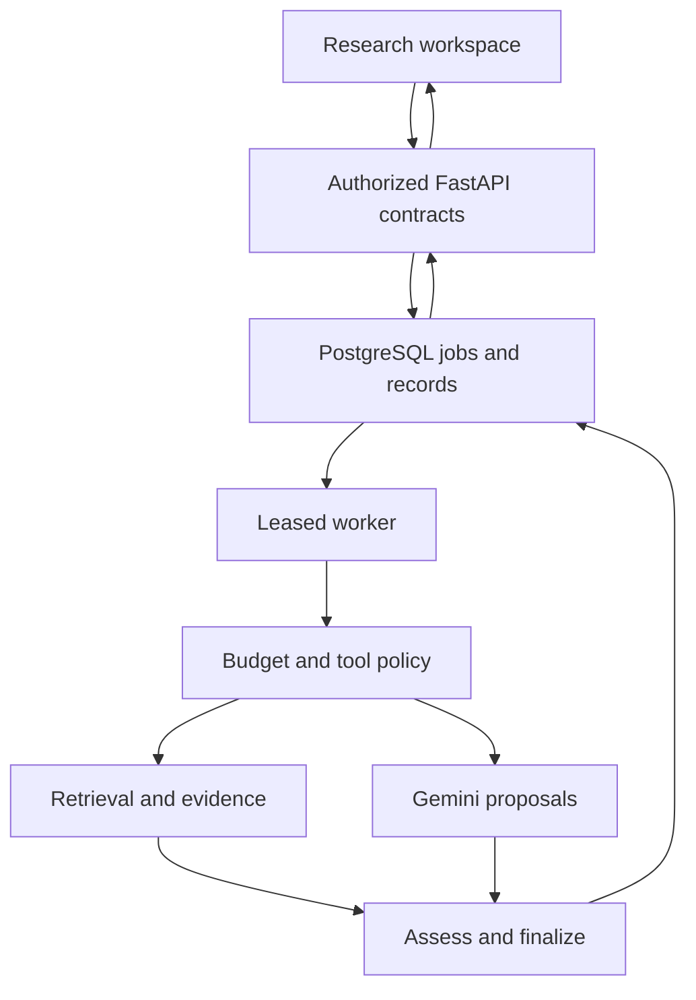

# ARES V3 — M12–M15 implementation plan

**Planning date:** 5 October 2026  
**Baseline:** supplied `ARES_M11_release_candidate.zip`, ARES `0.11.0`, migration head `0012_visual_artifacts`  
**Archive SHA-256:** `a1384d7e4e7c30dbc53d5e86fe54064818cf47c83e4007b15a707da08ea71fc0`  
**Execution method:** manual development in your IDE, assisted by your LLM, one reviewed task at a time.  
**Scope:** implementation-ready architectural roadmap; this document does not implement or deploy V3.

## 1. Product direction and non-negotiable constraints

Build an evidence-first research application that can retrieve across the web and private multimodal assets, produce professional reports, and execute bounded, inspectable research workflows. Preserve M01–M11 behavior and provenance. Make it useful to students, researchers, developers and small teams on ordinary hardware.

“FAANG-level” means observable engineering properties here: explicit interfaces, authorization at every boundary, bounded resource use, migration compatibility, reproducible artifacts, meaningful tests, documented failure behavior and measured improvements. It is not a certification or a promise of flawless code. GitHub distinction should come from reproducible evidence and useful workflows, rather than a Perplexity UI clone or a long integration list.

1. **Gemini is the only allowed paid runtime API.** Local models, parsing, charts, storage, testing and workflow orchestration use local/open-source components. Public source APIs may require free keys and impose quotas. No subscription-dependent fallback.
2. **No rewrite.** Retain React/Vite, FastAPI, SQLAlchemy/Alembic, PostgreSQL/pgvector, the existing durable worker, blob store, OIDC/CSRF/RLS boundaries and established evidence IDs/locators.
3. **PostgreSQL remains the system of record.** SQLite remains a deterministic demo/test fallback, without production performance or tenant-isolation equivalence claims.
4. **Every feature is connected end to end:** admission → durable job → budgeted execution → authorized persistence → typed API/events → UI → export → tests → documentation.
5. **Model output is a proposal.** The server decides permissions, tools, network targets, arithmetic, transitions and publication. Never execute model-generated code, SQL, chart options or shell commands.
6. **Read-oriented agents first.** No unattended purchasing, publishing, messaging, account changes or remote code execution. V3 provides research, comparison, calculation and monitoring workflows with inspectable results.
7. **No deployment execution.** Retain local run/recovery instructions and portability; public hosting decisions remain yours.
8. **Be honest about cost:** zero additional API subscription does not mean free electricity, hardware, hosting or unlimited provider access. Heavy media/reranking remain optional resource profiles.

## 2. What M11 actually provides

This plan is based on inspection of the attached source, contracts, migration files, release report and CI definitions. Repository paths below are relative to the ARES root. **Existing** means observed in source; it does not mean every real-world promotion gate has passed.

| Area | Existing M11 integration | V3 continuation |
|---|---|---|
| Research engine | `backend/src/ares/application/engine.py`; bounded discovery tracks, coverage facets, second-wave research, synthesis and assessments | Extract testable stages; add retrieval policy and workflow executor without parallel pipelines |
| Durable execution | `worker/main.py`, `application/run_context.py`, `checkpoints.py`, repository job/resource leases and usage ledger | Transport-aware cancellation, prompt-aware checkpoints, workflow nodes and schedule fencing |
| Persistence | `application/repository.py`, `adapters/db.py`, migrations through `0012` | Narrow repository interfaces and additive workspace-owned records |
| RAG | `application/rag.py`, `persistent_rag.py`, `indexing.py`; indexed PostgreSQL lexical retrieval, exact vector search, weighted RRF | Versioned profiles, local reranking, parent context, multilingual slices and retrieval traces |
| Multimodal | `asset_ingestion.py`, `media_ingestion.py`; immutable extractions, table cells, transcripts, sampled frames, local OCR/ASR | Better cross-modal retrieval and evidence quality; retain page/cell/time/frame locators |
| Source providers | SearXNG, OpenAlex, Crossref, arXiv and GitHub adapters; safe fetch and optional browser sidecar | Quota-aware provider policy, Wikimedia/Europe PMC/RSS adapters behind common contracts |
| Security | OIDC PKCE, sessions/CSRF, workspace roles, PostgreSQL FORCE RLS, separate API/worker roles | Preserve boundaries through refactors; add agent and export authorization tests |
| UI | `apps/web/src/app/App.tsx`, research/workspace features, deep links, safe GFM, themes, evidence drawer and media/PDF viewers | Focused workspace components, agent progress, report types, comparison and accessible polish |
| Visuals | `application/visualizations.py`, `domain/visualizations.py`, ECharts/React Flow; lineage-bound artifacts and CSV | Deterministic report-linked visuals and explicit calculations; keep table alternatives |
| Exports | `application/exports.py`; Markdown and JSON; separate authorized visualization CSV | Unified versioned report model plus deterministic HTML/PDF and evidence manifests |
| Quality | Backend integration/security suites, Vitest, migration/release scripts, offline regression and browser smoke | Hermetic authenticated E2E, recovery tests, held-out relevance/support scoring and resource budgets |

### 2.1 Audit findings that determine M12

| Finding | Evidence | Required response |
|---|---|---|
| Broad modules increase change coupling | `repository.py` ~3,345 lines; `engine.py` ~1,301; `api/app.py` ~1,048; `App.tsx` ~562 in supplied archive | Split by responsibility under compatibility facades; do not chase arbitrary line-count targets |
| Waiting timeout is not execution cancellation | `_synthesize` and `_semantic_assess_claim` use thread futures, `future.cancel()`, `shutdown(wait=False)` | Pass remaining timeout through existing provider port; prove transport teardown/resource ownership; do not release a slot while a live request still occupies it |
| Checkpoint identity is incomplete for future prompt changes | `synthesis.final` key contains query/model/evidence/output bound, but no explicit prompt revision | Include prompt/schema/provider/config identity; retain conservative accounting and document crash-window duplicate billing risk |
| Generated types are partial schema translation | `scripts/generate_frontend_types.py` implements its own subset; runtime validators and `types.ts` are separately maintained; `openapi-typescript` is already installed | Make pinned OpenAPI generation canonical and validate runtime payloads; audit union/discriminator compatibility |
| Static mypy configuration is not an enforced gate | Root `pyproject.toml` has strict mypy; `Makefile check`/CI do not invoke it | Introduce an incremental, explicit typing gate; enforce new boundaries immediately |
| Browser smoke depends on preexisting IDs and has no login/storage-state setup | `scripts/e2e_m11.py` opens a new unauthenticated browser context | Add seeded fixtures and test OIDC/session setup; preserve real auth checks rather than disable them |
| Held-out gate checks manifest shape, not answer correctness | `scripts/validate_m11_heldout.py` validates cases/tags/annotation references | Build an evaluator and human annotation process; do not equate manifest validity with quality |
| Supplied archive rebuild emits duplicate entries | `release_archive.py` includes existing SBOM/manifest then appends generated versions; verifier still passes | Exclude generated root artifacts from source enumeration; assert unique entry names; preserve deterministic rebuilds |
| Cost policy does not express the new Gemini-only paid exception | `Settings.validate_live_mode` requires strict-free and rejects general billable-provider flag; Gemini has separate quotas | Add explicit Gemini billing permission and bounded spend while keeping other paid services denied |
| Local index identity lacks immutable artifact revision | FastEmbed runtime identity uses model name/dimensions and local cache | Pin model artifact digest/tokenizer/normalization; shadow rebuild profiles on changes |
| SSE compatibility costs duplicate wire copies | `event_stream.py` emits named and generic copies; frontend deduplicates and bounds activity | Preserve compatibility; add opt-in versioned wire behavior only after measurements and client migration |

These are audit observations and risk hypotheses, not claims of a reproduced exploit. The supplied archive itself has **no duplicate entries**; duplicate metadata occurs when rebuilding from its extracted contents.

### 2.2 Validation evidence and limits

- M11's report records **193 backend passes / 7 PostgreSQL-only skips**, 18 frontend tests, a successful frontend build and source release proof. Those are the prior implementer's reported results, not fresh test results from this planning run.
- During this audit, Python AST parsing passed for 75 backend source files. `python scripts/verify_m11_release.py` returned `gate_passed: true`, with duplicate-entry warnings during its rebuild checks.
- No fresh backend pytest, browser, PostgreSQL/RLS, live provider or model-quality suite was run here. The review environment lacks the product's pytest/SQLAlchemy/FastAPI dependencies and configured services.
- M11's documented open gates remain open: target-role RLS/pgvector, browser E2E, mixed-load/recovery/restore, licensed held-out multimodal evaluation, live OIDC/provider/media/browser smoke and human testing.

## 3. Architecture and phase sequence

Recommended approach: **strengthen the existing modular monolith, then introduce small capability layers over its current contracts**. A microservice rewrite adds network and operational cost; a framework-led agent rewrite duplicates existing jobs, budgets and checkpoints. Reconsider service separation only when measured workloads demand independent scaling or isolation.

| Phase | User-visible result | Dependency and release gate |
|---|---|---|
| **M12** | Reliable, typed and measurable foundation; predictable failures and faster first interactions | M11 source baseline; close critical correctness/auth/recovery gates before M13 promotion |
| **M13** | Stronger multimodal retrieval and professional evidence-backed answers | M12 contracts, tracing and versioned index identity |
| **M14** | Bounded research agents, free source tools and opt-in research watchlists | M13 retrieval traces and assessed evidence; M12 durable execution |
| **M15** | Polished research/report workspace, portable documents and credible V3 release | M12–M14 integration, E2E and independently scored quality evidence |



Agent plans, reports and visuals all refer back to the same run/evidence lineage. No new store replaces that lineage. Durable events are authoritative; notifications merely wake clients. Final assessed answers remain authoritative over provisional generation.

### 3.1 Integration rules for every PR

Use existing composition in `application/runtime.py` and worker startup. Define a domain contract before adapter implementation. Keep repository transactions short and never hold a database lock during remote/model calls. API handlers authorize and admit work; workers perform long work; GET never starts a model/job or mutates research state.

Every new tenant-bearing table has `workspace_id`, foreign keys that enforce ownership, FORCE RLS policies and role-specific grants. Worker BYPASSRLS makes explicit workspace/run binding mandatory: “RLS exists” is not sufficient for worker queries. Recheck current authorization before publication/download. Revoke access without allowing caches, plans or exports to leak data.

Feature flags default off for unfinished/new expensive capabilities. Readiness reflects schema, provisioned model artifacts, permissions and available workers, not just flags. Use explicit capability/degradation status in UI. Optional capability failure preserves core answer/evidence access.

### 3.2 Migration sequence

Milestone numbers and migration numbers differ: **M11 already ends at schema 0012**. Never create an M12 migration also named 0012 or rewrite existing migration history. Proposed revisions below assume no concurrent changes; allocate actual revisions from current head during implementation.

| Milestone | Proposed additive revisions | Data treatment |
|---|---|---|
| M12 | `0013_execution_identity` if persisted policy/prompt identity needs storage | Nullable/new defaulted columns; mark old checkpoints legacy and disallow reuse across changed prompt identity |
| M13 | `0014_retrieval_profiles`, `0015_retrieval_traces` | Versioned profiles, parent relationships and bounded trace records; old vectors remain readable |
| M14 | `0016_workflow_runs`, `0017_watchlists` | Workspace-owned plans/nodes/tool calls and schedules; reuse existing job/event/usage contracts |
| M15 | `0018_report_documents` | Immutable report versions/export lineage; adapt legacy answer blocks on read |

Write a schema diff first. Reuse current records where adequate; remove unnecessary proposed tables before migration approval. Expand → backfill in resumable bounded batches → switch by flag → retain old readers for one release. Rollback disables new writers/capabilities and keeps additive data. Destructive downgrades are not the operational rollback strategy.

## 4. M12 — Engineering foundation, correctness and measured efficiency

**Objective:** make the existing system safe to extend without losing invariants, introducing runaway work or hiding untested boundaries. This phase has priority over adding tools.

**Entry:** pin supplied source or its corresponding Git commit, capture environment/tool versions and preserve an M11 comparison fixture set. Do not silently change dependencies while establishing baseline.

### M12-01 — Establish executable baseline and promotion evidence

**Touch:** `Makefile`, `.github/workflows/ci.yml`, `scripts/e2e_m11.py`, `scripts/perf_baseline.py`, `scripts/load_smoke.py`, `docs/development/STATUS.md`; new `docs/development/M12_BASELINE.md`.

- Reproduce frozen backend/frontend installs, generated contracts, offline eval and all current tests. Report expected versus unexpected skips separately.
- Add local/CI PostgreSQL/pgvector with separately provisioned API, worker and migration roles. Run FORCE-RLS cross-workspace and pooled-context reset tests under intended roles, not only a superuser.
- Preserve M11 browser smoke as compatibility coverage; create deterministic browser fixtures with run/evidence/assets and 200 persisted events, an isolated test OIDC issuer and explicit storage-state bootstrap.
- Create a failure matrix: worker killed before/after write, provider stalled/rate-limited, database unavailable, expired session, revoked membership, corrupt asset, queue saturation and export interruption.
- Baseline latency by stage, SQL count, queue delay, event delivery, peak RSS and frontend initial transfer. Separate cold/warm model and cache states.

**Acceptance:** clean clone can execute the offline core and authenticated browser fixture instructions; critical PostgreSQL tests do not skip in the provisioned job; baseline reports include configuration and raw measurements. Live/human gates remain explicitly unrun until actually executed.

### M12-02 — Refactor by boundaries with compatibility facades

**Touch:** `application/repository.py`, `application/engine.py`, `api/app.py`, `adapters/db.py`, `apps/web/src/app/App.tsx`.

**Proposed additions:** `ports/repositories.py`, `application/research_stages/`, `adapters/persistence/`, `api/routes/`, frontend `features/auth/` and `features/research/ResearchWorkspace.tsx`. These are new locations, not existing files.

- Inventory callers first. Extract repository responsibilities in this order: read/query views → artifacts/visuals → retrieval → ingestion → job/quota/lease writes. Retain `Repository` facade while imports migrate.
- Define narrow Protocol interfaces for run/evidence reads, retrieval, job/lease writes, ingestion and export persistence. Application/domain modules do not import FastAPI or ORM row internals at new boundaries.
- Extract engine discovery/retrieval/synthesis/assessment/finalization collaborators while retaining `ResearchEngine.execute(lease)` as worker entry point.
- Extract routers with identical paths, status codes, dependencies and OpenAPI schemas. Keep startup/resource ownership in one composition root.
- Split App orchestration into auth/session, run-selection and workspace-view components. Preserve query cache keys, workspace-scoped invalidation and deep-link behavior.

**Tests:** characterize route and transaction behavior before moving code; unchanged evidence IDs and deterministic final reports on frozen inputs; stale worker writes denied. One responsibility per PR; do not combine dependency upgrades with refactors.

### M12-03 — Deadline, cancellation and resource ownership

**Touch:** `engine.py`, `run_context.py`, `ports/research.py`, Gemini/semantic/safe-fetch adapters, `worker/main.py`, `checkpoints.py`.

- Existing LLM port already accepts `timeout_seconds`; pass the clamped remaining deadline through `_synthesize` to the adapter and verify SDK transport behavior.
- A cancelled thread future cannot stop an already running call [S3]. Use cancellable async transport for network calls where supported, or a bounded isolated subprocess for truly uncooperative synchronous work. Do not rewrite all workers to async merely for style.
- Keep a capacity slot owned until request termination is observed. Quarantine/drain an unresponsive provider worker; allow lease expiry only with fencing that prevents stale persistence.
- Preserve persisted wall-clock deadline across retries. Check cancellation before each tool call, after return and before publication. Stop dispatching new work immediately; preserve validated partial evidence.
- Extend checkpoint hash with prompt revision/digest, response schema version, adapter version, model identity and relevant generation configuration. Exclude secrets; include ordered evidence content hashes and provenance policy version.
- Document the unavoidable crash window between external response and local commit. Use provider idempotency only if supported; do not promise exactly-once billing. Conservatively reserve usage and bound retry count.

**Tests:** stalling fake transport terminates or remains accounted; 30 consecutive timeouts do not cause unbounded thread/RSS growth; late response cannot publish after cancellation or lease loss; changed prompt invalidates checkpoint; unchanged identity restores it.

### M12-04 — Typed contracts and safe compatibility

**Touch:** `domain/`, `ports/`, `backend/openapi.json`, `scripts/generate_frontend_types.py`, frontend `lib/api/{generated.ts,types.ts,runtime.ts,client.ts}`, root typing configuration.

- Use the existing pinned `openapi-typescript` dependency to generate canonical transport types, including operation request/response mappings. Retain the Python command as a delegating compatibility wrapper if needed.
- Keep ergonomic UI models as explicit mapping layers, not competing copies of server schemas. Runtime validation remains necessary because TS types do not validate JSON.
- Generate or systematically validate runtime discriminated unions for new retrieval/workflow/report payloads. Bound arrays/string sizes and reject non-finite numeric values.
- Add contract drift CI: regenerate OpenAPI and TS from source and fail on differences. Add positive/negative fixtures for unknown additive events, missing required fields and supported legacy schemas.
- Introduce mypy gate for domain/ports/new extracted modules immediately; publish a finite legacy-exclusion list with owning task IDs. Ratchet toward full application typing by M15; do not use blanket `ignore_errors` or pervasive `Any`.
- Expand Ruff rules gradually after behavior baselines; enforce formatting/import/style only in controlled batches.

**Acceptance:** one transport schema source; new code passes typing; union/event compatibility tested; changed public response requires schema and consumer updates in the same PR.

### M12-05 — Gemini-only paid policy and free provider limits

**Touch:** `api/settings.py`, `domain/budgets.py`, `run_context.py`, `application/runtime.py`, quota persistence and provider adapters; `.env.example`, doctors and tests.

Add a typed `ProviderPolicy` with billing class (`local`, `public_free`, `gemini_paid`), allowed operations, shared quota key, concurrency, request/token bounds and daily spend ceiling. Keep the current general paid-provider deny behavior. Introduce explicit `GEMINI_BILLING_MODE=free|paid` and `GEMINI_MAX_DAILY_SPEND_USD`; do not globally set `ALLOW_BILLABLE_PROVIDERS=true` to admit Gemini. Document how legacy strict-free settings normalize into this policy.

- Default free mode; your paid profile explicitly enables Gemini only. Reject Jev and other metered non-Gemini services.
- Paid-mode admission reserves worst-case input/output cost from a versioned operator-configured price table, including optional thinking tokens where relevant. Reconcile actual usage; failed/unknown calls retain conservative reservation. Local ceiling is an application safeguard, not a guaranteed provider invoice cap.
- All synthesis, semantic checks, planning and embeddings share the appropriate provider quota/spend ledger. No agent bypasses it.
- OpenAlex has a free daily allowance and metered usage beyond it [S5]. Permit only free usage, reject premium/content operations unless verified free, never provision prepaid balance and stop/degrade at configured allowance. Cached usage headers and provider hard rejection remain authoritative; concurrent reservations must serialize.
- Parse rate-limit responses/headers and bounded Retry-After safely. Retry only within deadline, never retry authorization/validation errors, and cap attempts. Preserve source freshness and degraded-track signals.

**Tests:** Gemini paid allowed only with explicit bounded policy; other paid providers rejected; concurrency cannot overspend local reservations; provider outage keeps document retrieval usable; no credentials in events/logs.

### M12-06 — Performance, streaming and observability

**Touch:** `event_stream.py`, `ingestion_stream.py`, `observability.py`, retrieval repository queries, `useRunStream.ts`, Vite config and lazy modules.

- Measure before optimization. Batch evidence/chunk reads and remove demonstrated N+1 access. Use `EXPLAIN (ANALYZE, BUFFERS)` on representative authorized PostgreSQL queries, not SQLite timings.
- Retain indexed lexical retrieval and exact pgvector baseline. Add approximate indexes only after M13's recall/tenant-filter experiments justify them.
- Keep bounded replay, sequence deduplication, periodic authorization rechecks and snapshot recovery. Add SSE tests for duplicates, gaps, reconnect Last-Event-ID, revoked access and terminal/post-run artifact races.
- If poll load is material, add PostgreSQL LISTEN/NOTIFY as a wakeup hint with reconnect/fallback polling; durable event rows still supply replay. Bound listener connections. Introduce a v3 stream variant to remove named/generic duplication only after old-client compatibility tests.
- Extend existing optional OpenTelemetry integration with stage spans and bounded histograms. Do not log prompts, evidence text, headers or tenant/query identifiers as metric labels.
- Bundle-report initial surface separately from optional PDF/ECharts/graph chunks. Use ECharts selective module imports where measured. Preserve deferred loading and loading/error states.

**Proposed targets, not observed claims:** on a recorded 4-vCPU/8-GiB SSD host, 10 active research runs and 50 SSE clients: p95 local admission ≤300 ms; event commit-to-visible ≤1 s; cancel acknowledgement ≤1 s and no new dispatch within 2 s; warm local retrieval over 50k selected-workspace chunks ≤750 ms. Stub provider latency when measuring internal overhead. Include p50/p95/p99 and saturation behavior. Gemini latency is reported separately, not guaranteed.

### M12-07 — Packaging and recovery proof

**Touch:** `release_archive.py`, `verify_m11_release.py`, migration verifier, backup/restore scripts, CI and SBOM generator.

- Exclude preexisting root `SBOM.cdx.json`/`RELEASE_MANIFEST.json` before appending generated copies. Assert unique ZIP paths, safe paths and consistent checksums; compare two builds from an extracted release.
- Generalize release verifier/version metadata while preserving M11 fixture compatibility. Pin tested tools/actions; retain no-secret checks and least-privilege CI tokens.
- Perform kill/restart and backup/restore rehearsal on isolated PostgreSQL data. Validate document/media/blob references and workspace isolation after restore, not merely database restore exit status.
- Ensure optional telemetry/model/browser failure does not block core startup. Document queue backpressure and operator recovery without source editing.

**M12 exit gate:** baseline/auth/RLS/migration/cancellation/contract/archive/recovery tests pass in their intended profiles; no unexplained skips; unresolved independent human/live gates explicitly recorded. M13 implementation may be prototyped behind flags, but do not promote dependent agent behavior while critical M12 gates fail.

**Rollback:** keep facades and old API readers; disable v3 streaming/new policy/profile flags; retain migrations and persisted identities. Refactor rollback is code-level reverting of isolated PRs, not data deletion.

## 5. M13 — Advanced RAG and professional answer quality

**Objective:** improve retrieval and explanation quality with measured local tools, without creating a second evidence store or claiming the model has verified its own assertions.

**Entry:** M12 ownership/deadline/contracts/profile identity work is complete; a licensed annotated corpus is available. At minimum preserve M11's 100-question held-out requirement and add retrieval relevance labels separate from generated answers.

### M13-01 — Versioned corpus and retrieval profiles

**Touch:** `indexing.py`, `persistent_rag.py`, `rag.py`, `adapters/local_embeddings.py`, retrieval persistence, `domain/assets.py` and migrations.

Define an immutable profile identity: model ID, exact weight/artifact digest, tokenizer/preprocessing version, dimensions, distance metric, language coverage, chunk policy and parser/extraction revision. Same dimensions do not make models compatible.

- Store chunk text as immutable extraction output; add parent-section/adjacency relationships without changing original evidence locators.
- Provision models explicitly, verify checksums/licenses and load local files only. Readiness fails closed for a missing/mismatched artifact.
- Reindex in bounded ingestion jobs to a shadow profile; old profile serves queries until new profile validation/coverage passes. Resume idempotently after partial batches.
- Keep lexical publication usable before semantic readiness. Track progress/error/coverage accurately and propagate asset deletion to derived indexes/traces.

**Tests:** same-name changed model digest is a different profile; mixed-profile comparisons rejected; no corpus embeddings generated during interactive queries; interrupted reindex resumes without duplicates; deleted asset is never retrieved.

### M13-02 — Query policy and bounded decomposition

**Touch:** `planning.py`, `domain/research.py`, `persistent_rag.py`, engine retrieval stage.

Classify exact identifier, narrow fact, comparison, multi-hop, temporal or document-analysis intent. Preserve raw query and inferred language; avoid treating inferred filters as user-provided constraints. Reuse existing facet and date-window contracts.

- Exact DOI/arXiv/repository/quoted-string queries retain deterministic priority.
- Allow up to three subqueries for a multi-facet research task, all within the existing run search/token/wall-clock limits. Quick mode defaults to one.
- Gemini decomposition is optional and schema-bound; deterministic fallback remains functional. One failed planner cannot block ordinary research.
- Carry authorized source/document scope into every child query. No widening private corpus scope to improve recall.
- Retrieve literal-language candidates first; optional translation preserves the original query and source quotations. Record translation as derived context, not independent evidence.

**Tests:** facets do not increase budgets; ambiguous dates remain marked; private scope preserved across decomposition; planner injection cannot invent tools or document IDs.

### M13-03 — Hybrid candidates, local reranking and context assembly

**Touch:** `persistent_rag.py`, `rag.py`, repository retrieval methods; new `ports/reranking.py`, `adapters/local_reranker.py`, `application/context_assembly.py`.

- Start from existing weighted RRF. Preserve lexical/semantic ranks and profile identity; stable tie-breaking ensures replayability.
- Initial bounds: up to 40 lexical + 40 semantic candidates per query, deduplicate to ≤60, local rerank ≤30, final context ≤12 packets. All bounds also obey existing token and document budgets.
- Candidate reranker: FastEmbed `TextCrossEncoder` with `Xenova/ms-marco-MiniLM-L-6-v2`, whose supported-model listing identifies Apache-2.0 [S6]. Confirm exact downloaded model license/revision before provisioning. English model is not a multilingual promise.
- Use a bounded local ML process/profile. Initial warm rerank budget 1 s on the reference CPU; timeout or unavailability falls back to RRF and marks degradation. Cold loading happens at readiness/warmup, not silently inside first query.
- Evaluate multilingual embedding/reranking candidates separately; exclude noncommercial model licenses from unrestricted default distributions.
- Add parent-section expansion and adjacent transcript chunks only within token/source diversity limits. Table headers/units accompany cited cells. Preserve the exact supporting segment for citation even when broader context is included.
- Source diversity uses existing origin groups, not number of URLs. Conflicting passages are retained, not reranked away just because they weaken a conclusion.

**Tests:** unit/context retention, repeated mirrors, short exact facts, multi-hop joins, transcript boundary facts, OCR uncertainty and citation-to-segment consistency. Compare against M11 RRF with reranker disabled.

### M13-04 — Index scaling only when justified

**Touch:** PostgreSQL vector retrieval, additive index migrations, `scripts/eval_m10_retrieval.py`; new `scripts/benchmark_rag_v3.py`.

Benchmark 5k/50k/250k chunks with narrow and broad authorized document filters. Exact search is the ground truth. pgvector warns that approximate index filtering happens after index scanning and can reduce results/recall [S7].

If exact retrieval exceeds the recorded target, test profile-specific HNSW with compatible vector dimensions/operator class and tenant/document filters. Prove index usage with EXPLAIN. Tune iterative scan/ef_search inside local transaction settings; do not apply per-query settings globally on pooled sessions. Require Recall@20 ≥0.95 against exact eligible-neighbor results on each critical filter slice. Fall back to exact for small/selective corpora. Partitioning is a measured later option, not one partition per user by default.

**Acceptance:** no unauthorized candidates; model/dimension profiles never mixed; predictable memory/build time; documented degraded recall and exact fallback. Do not add Qdrant/Elasticsearch merely because local FastEmbed is used.

### M13-05 — Retrieval traces and auditable answer assessment

**Touch:** `domain/research.py`, retrieval persistence, `finalization.py`, `decisions.py`, Gemini synthesis/semantic adapters, `RunQualityPanel.tsx`.

Persist bounded `RetrievalTrace` metadata: query/facet hash or authorized stored query, profile, filters, candidate IDs/ranks, selected packet IDs, stage times, cache freshness, coverage gaps and policy revision. Keep raw private text out of general logs and traces out of other workspaces.

- Return a typed `AnswerOutline` with sections/facets and claim proposals referencing existing evidence IDs. It is not a second truth source.
- Run numeric/unit/date/polarity guards before optional semantic assessment. Preserve assessment state, method/version, rationale and supports/contradicts/contextualizes relations.
- Only render factual narrative assembled from finalized claims or explicitly label inference/uncertainty. Do not append a free-form summary that bypasses validation.
- Separate confidence in source extraction, retrieval relevance and claim support. Do not show uncalibrated model percentages as factual probabilities.
- Produce “what is known / disagreement / missing evidence / limitations” where appropriate. Treat abstracts as abstracts, sampled video as partial coverage and OCR/transcription as uncertain extraction.
- Preserve professional tone: direct answer first, proportionate detail, clear terminology, dated scope and citations adjacent to supported assertions.

**Tests:** unsupported intro/conclusion cannot bypass claims; 10 vs 90, negation, unit conversions, stale dates and same-source repetition; contradictory evidence stays visible; semantic checker failure produces weaker assessment, not fabricated support.

### M13-06 — Quality evaluation and user-facing controls

**Touch:** `evals/`, `evaluation/metrics.py`, held-out validator and protocol; frontend scope controls, quality panel and evidence drawer.

- Add an actual answer/retrieval scorer, not just manifest validation: required-facet coverage, relevance Recall@k/nDCG, citation resolution, citation support, contradiction handling, abstention and latency/token cost.
- Keep development, calibration and held-out sets separate. Freeze annotations before tuning. Have humans review material supported/contradicted claims and double-annotate at least 20% of cases; record disagreement.
- Starting release targets: citation references resolve 100%; zero cross-workspace leaks; retrieval Recall@20 ≥0.90 on answerable annotated passages; human-reviewed citation support ≥0.95. Report denominators, confidence intervals and per-modality/language slices. These are proposed gates, not claimed scores.
- Require improvement over M11 on the same frozen corpus without >20% p95 end-to-end regression. If the absolute quality target fails, record the gap and do not hide it behind the aggregate.
- UI exposes scope, extraction coverage, profile readiness and evidence gaps in plain language. Advanced retrieval details stay in an expandable inspector.

**M13 exit:** gains and ablations demonstrated; no regression in authorization/citations; local-only fallback works; supported language/modality matrix documented. Disabled reranker still yields a usable answer.

**Rollback:** select previous retrieval profile and disable reranking/decomposition; retain immutable profile/trace records; legacy answers remain renderable.

## 6. M14 — Bounded agentic research and free tools

**Objective:** move beyond one-shot Q&A into durable research workflows while retaining server authority, small budgets and evidence-backed results.

**Entry:** M12 execution fencing and M13 retrieval/assessment are promoted. Start with three templates, not an open-ended autonomous agent.

| Template | Workflow | Example |
|---|---|---|
| Research brief | Plan facets → gather → retrieve → check → draft → finalize | Literature overview with supported conclusions and unresolved questions |
| Evidence comparison | Resolve entities → collect scoped evidence → normalize comparable facts → compare → report | Compare libraries from pinned documentation/releases and disclose missing measurements |
| Dataset analysis | Select authorized table → inspect schema → validated operations → deterministic calculation → evidence-linked chart/report | Group costs by category without executing Python generated by the model |

### M14-01 — Tool registry with enforceable contracts

**Touch:** existing `ports/`, source adapters, `application/runtime.py`, safe-fetch/security/budget code; new `domain/tools.py`, `ports/tools.py`, `application/tool_executor.py`.

Define `ToolSpec`: stable name/version, input/output JSON schema, allowed modes/workspace roles, billing class, network target policy, timeout, byte/result limits, idempotency classification and evidence publication policy. Define `ToolContext`: authenticated workspace/run/node IDs, lease token, deadline, policy version, remaining budgets and permitted asset/source IDs. Context comes from the server, never model arguments.

`ToolResult` carries structured payload references, source/evidence IDs, retrieval/capture timestamps, license/attribution, warnings and typed failure. Tool errors use stable categories (`not_authorized`, `invalid_input`, `rate_limited`, `unavailable`, `deadline`, `unsupported`) rather than raw credential-bearing exception text.

Wrap existing web/academic/software/document retrieval first. New tools must reuse safe fetching and normalized source identity. Validate inputs before dispatch, output before persistence and workspace membership before publication. Model descriptions cannot override policy.

**Tests:** hidden tool denied; fabricated workspace/token ignored; malicious URL denied on every redirect; oversize output truncated/rejected consistently; tool result instruction text remains untrusted evidence.

### M14-02 — Free source/tool adapter set

| Tool | Implementation and source contract | Billing, fallback and bounds |
|---|---|---|
| Existing SearXNG web search | Registry wrapper around existing adapter | Local service; upstream engines may block/rate-limit; explicit partial results |
| Crossref DOI/update lookup | Extend existing Crossref adapter for exact works, deposited relations/update metadata | Public metadata API; polite contact/headers and cache; absence of a retraction flag is not proof of validity [S8] |
| arXiv/OpenAlex research | Reuse adapters and normalized identifiers | arXiv pacing retained; OpenAlex free-only cap; Crossref/arXiv fallback, no paid top-up |
| GitHub repository facts | Extend existing read adapter for selected public README/releases/issues, pinned ref and license metadata | Respect separate search/core quotas and 403/429/header backoff [S9]; no repository execution or uploads |
| Wikimedia reference lookup | New `adapters/wikimedia.py`, fixed language/domain targets, search/page revision lookup | User-Agent, bounded serial/batched requests and caching [S10]; preserve revision ID and attribution; not authoritative for every domain |
| Europe PMC literature | New `adapters/europe_pmc.py`, REST search plus permitted open-access XML through safe fetch | Candidate public source [S11]; live contract/terms verification before enabling; preserve PMID/PMCID/DOI, article license and full-text availability |
| RSS/Atom collection | New `adapters/rss.py`; user-authorized public feeds, conditional ETag/Last-Modified | No paid API; safe URL and XML parsing with external entities disabled; ≤10 feeds/watchlist, ≤100 entries/poll |
| Local table operations | New `application/table_operations.py`; fixed schema for filter/group/aggregate/join/units | Standard-library/SQLite in-memory or approved local engine; no arbitrary SQL/Python; row/time/memory limits |

Add source adapters in separate PRs, after registry/authorization. APIs expose different data rights: free API access is not blanket permission to redistribute article bodies. Preserve license and abstract/full-text distinctions. Record terms/docs review date and add fixture-based adapter contract tests; live smoke is opt-in.

Do not add paid search/crawl/research agents, hosted rerankers, managed vector stores or free-trial dependencies. Do not use public SearXNG instances as guaranteed infrastructure.

### M14-03 — Durable bounded workflow executor

**Touch:** checkpoints, run context, worker, state machine and new workflow domain/application/persistence modules. Reuse existing job leases, durable events and admission limits.

`WorkflowPlan` includes template/version, goal, facets, nodes, dependencies, allowed tool names, expected outputs and stop conditions. Server validates a DAG and budget before execution. Initial bounds: ≤12 nodes, depth ≤4, ≤2 concurrent tool nodes, ≤2 retries per retryable node, one repair/replan round. All remain inside existing run-mode ceilings; V3 does not silently raise M07 budgets.

Node state: `pending → running → completed | failed | cancelled`; separately support `waiting_for_user` for a clarification boundary. Persist inputs/output references and identity hash. Resume only under a current lease; already completed compatible nodes return stored results. Changed plan/tool/profile version creates a new identity.

- Gemini may propose plans/tool arguments through structured outputs/function calls [S1–S2]. Disable automatic unbounded SDK tool execution; execute only validated proposals through registry.
- Independent nodes run concurrently within fleet/per-run limits; dependency failures trigger explicit skip/partial outcome.
- Stop on budget, no new evidence, cancellation or sufficient facet coverage. A “critic” loop cannot increase authority or run forever.
- Clarification waits release compute resources; persist a separate bounded resume horizon. Revalidate membership/assets and fresh budget before resuming. Do not reset spent usage or secretly extend a run deadline.
- Checkpoint evidence objects and references, not model chain-of-thought. Expose concise actions/results and decision rationale only.

**Tests:** crash at every node boundary; duplicate job claim; lease loss mid-call; resume after role change; cycle/unknown tool rejected; late result fenced; dependency failure partial report; no-evidence loop terminates.

### M14-04 — Deterministic calculation with lineage

**Touch:** table contracts, visualizations, report/finalization and new calculation module.

Accept an allowlisted operation AST over authorized table IDs/columns with typed units, null policy and bounded grouping/join cardinality. Never accept string SQL or executable expressions. Use Decimal for exact financial-like values where applicable; preserve original data precision and distinguish computed from extracted values.

Persist operation/version, input extraction/dataset hashes, result rows and contributing cell/evidence IDs. Bound join expansion and abort excessive output. Derived chart values must point to a calculation record and its evidence, not masquerade as quoted source numbers. UI and export show formula/operation, units and exclusions.

**Tests:** incompatible units rejected; missing values counted; numeric strings validated; division by zero explicit; duplicate joins bounded; results deterministic; CSV formula injection remains escaped.

### M14-05 — Opt-in watchlists and evidence changes

**Touch:** new watchlist records/API/routes/UI; existing job admission, provider cache and source versions.

Create schedules only when user explicitly enables one in ARES; this plan creates no schedule. Minimum interval initially 6 hours, ≤5 enabled watchlists/workspace. Store timezone for display, UTC next-run time and bounded missed-run policy (coalesce to one, never flood).

Use a PostgreSQL scheduler lease plus unique `(watchlist_id, scheduled_slot)` job key. Bind each scheduled run to its owner/workspace and current role. Skip/pause when permission, quota, source or capability changes. Apply workspace/fleet admission and separate daily watchlist budget; foreground work takes priority.

Detect changed source versions/content hashes, distinguish metadata-only from evidence changes and preserve before/after capture dates. Reassess affected claims; never silently overwrite the old report. Show in-app inbox/diff, no email/Slack sending. Provide pause/delete and retention controls.

**Tests:** two schedulers create one job; DST/UTC slot consistency; restart coalescing; revoked owner pauses schedule; exhausted Gemini budget performs no model call; misleading timestamp change does not count as a new factual discovery.

### M14-06 — Agent UX and optional MCP boundary

**Touch:** research activity/composer/quality panel; new `AgentPlanPanel`, `ToolResultCard`, `WatchlistPanel`; optional `adapters/mcp_tools.py` after core completion.

UI shows goal, permitted actions, source scope and budget before start; during work show current action, finished nodes, partial evidence, remaining bounded scope and cancel. Labels should describe user work, not internal worker machinery. Clarification is accessible and preserves resume links.

MCP is an **optional compatibility adapter**, not the execution authority or required runtime. An operator-controlled allowlist pins server/schema versions. Route MCP tools through the same registry/budget/evidence policy. Remote OAuth requires audience-bound tokens, consent, no token passthrough and SSRF-safe metadata discovery [S12]. No arbitrary server URLs, browser cookies or session-token forwarding. Disable on changed tool schemas until reviewed. If no concrete interoperability need exists, defer MCP rather than shipping a protocol-shaped security burden.

**M14 exit:** the three templates work end to end; crash/resume/cancel/auth/tool-injection tests pass; watchlist jobs are unique; every published result has inspectable lineage; optional sources can fail without losing core research. Paid service audit admits Gemini only.

**Rollback:** disable workflow/watchlist/tool flags, pause schedule dispatch, let current leases drain; keep prior completed evidence/reports readable and preserve node records for audit.

## 7. M15 — Professional workspace, documents and V3 release proof

**Objective:** turn the strengthened system into a polished, accessible and well-documented product with reproducible evidence of its capabilities.

### M15-01 — Unified immutable report document

**Touch:** `domain/models.py`, `finalization.py`, `exports.py`, visualization contracts and report persistence; new `domain/reports.py`, `application/report_builder.py`.

`ReportDocument` contains schema/template version, run/workspace identity, title, research question, scope/date, language, typed sections, assessed claim references, evidence references, tables/calculation references, visualization references, limitations, bibliography and generation/profile identity.

Section kinds initially: overview, findings, comparison, methodology, conflicts, limitations and next steps. Supported templates: concise answer, research brief, literature review and technical comparison. Reuse finalized claims rather than ask Gemini to invent a new export narrative. Heading/structural prose cannot smuggle unsupported facts. Adapt legacy `answer_blocks` to a read-only legacy report view; retain original bytes/hashes.

Report revisions are immutable and refer to prior revision; user edits distinguish authored text from assessed generated claims. Reassessment is explicit. Do not retain model reasoning traces or include internal operational secrets in exported manifests.

**Tests:** every factual section maps to finalized claim/evidence; legacy answers round-trip; deleted/revoked evidence is handled by documented redaction/access rules; stable snapshot hash; template cannot change assessment status.

### M15-02 — Deterministic document exports

**Touch:** existing ExportService/artifact endpoints and blob store; new renderer/export worker if needed.

- Generate Markdown, JSON manifest and sanitized standalone HTML from the same report snapshot. Keep existing Markdown/JSON API behavior backward compatible; new formats are additive.
- Add optional PDF through a local isolated Playwright print process, separate from the web-fetch browser sandbox. PDF input is trusted rendered HTML, with network disabled and fonts/assets provisioned locally. A PDF renderer must not fetch source links or remote images.
- Tables wrap/continue across pages; headings, footnotes, bibliography, units and provenance remain legible. Include title/scope/date/report version and partial-result limitations. Test multilingual fonts and long URLs.
- Prefer typed chart specs/server templates; embed deterministic locally rendered SVG/PNG where safe, with text/table alternatives. Do not render arbitrary model Mermaid/HTML/JavaScript. If Mermaid later becomes necessary, parse an allowlisted subset and render in isolation with external links/HTML disabled.
- Export creation is idempotent by authorized report hash + format + renderer version. Long PDF jobs use durable bounded work; GET/download is read-only. Recheck access at download, private/no-store headers, safe filenames and retention cleanup.
- Export provenance manifests include evidence identifiers/hashes/locators and licenses, not full copyrighted/private source blobs by default.

**Tests:** UI/Markdown/HTML/PDF claim consistency; remote network requests impossible during export; XSS/injection/CSV guards; overflow/page breaks; worker crash retry; revoked membership denies download. Snapshot tests use stable timestamps/fonts/renderer versions.

### M15-03 — UI/UX polish with existing visual language

**Touch:** `styles.css`, ResearchWorkspace, Composer, Answer/SafeMarkdown, EvidenceIndex/Drawer, RunQualityPanel, VisualizationWorkspace, workspace/auth and agent components.

Keep existing semantic light/dark tokens, routes and lazy viewers. Use an original ARES identity and improve research usability rather than copy a proprietary brand.

| Surface | Required behavior |
|---|---|
| Start/composer | Clear question field; scope/profile capability hints; optional attachments/template; useful empty-state examples; no hidden mode costs |
| Answer/report | Direct answer first, readable line length, collapsible methodology, stable citation markers and visible limitations |
| Evidence inspector | Open cited page/cell/time/frame, show extraction uncertainty and source version, keyboard focus return, accessible nonvisual path |
| Comparison | Side-by-side facts with units/dates/support status; missing values stay missing; origin duplicates identified |
| Agent progress | Task plan/actions/results, clarification/cancel/resume, clear partial/failed/paused states; no invented percentage completion |
| Library/assets | Index/extraction status, capability readiness, preview and deletion consequences; upload never reports “ready” before durable publication |
| Export | Template/format preview, lineage/partial status, rendering progress and understandable error retry |
| Watchlists | Scope/schedule/budget, pause, last successful check, actual changes and revoked/quota state |

Use consistent component states: loading, empty, unavailable, stale, partial, permission denied and success. Errors include a safe next action. Do not reveal stack traces or internal worker identifiers as primary UX.

Target WCAG 2.2 AA [S14]: keyboard paths, dialogs/focus, visible focus, contrast, labels, no color-only meaning, reduced motion, 320px reflow and 200% zoom. Screen-reader check is manual in addition to automated testing [S13]. Charts always have an accessible data table and concise description. Virtualize long lists only after measuring, preserving screen-reader/navigation alternatives.

**Design handoff:** component/state inventory, tokens, mobile/desktop layouts and named interactions in Markdown first; optional Figma frames must map to existing components/routes. Do not block implementation on Figma availability or buy UI kits.

### M15-04 — Full E2E and resilience suite

**Touch:** browser fixture harness from M12, backend integration/security tests, CI and new `scripts/verify_v3_release.py`.

Use pinned Playwright with deterministic seed fixtures and isolated test identity provider. Run Chromium/Firefox/WebKit on core flows; stub Gemini in PR CI and keep real Gemini tests opt-in. Fixtures isolate workspace state and clean up; no dependence on a developer's login [S15].

Required journeys:

1. Sign in → create workspace/run → stream validated answer → open web citation → export.
2. Upload PDF/image/CSV → await lexical/semantic readiness → research → inspect page/cell → produce chart/report.
3. Upload licensed audio/video → inspect transcript/frame/time range → research → preserve sampled-coverage warning.
4. Start comparison agent → rate-limit one optional provider → partial result → cancel/resume under current permissions.
5. Schedule watchlist → two scheduler instances → one run → evidence change diff → pause.
6. Expire session/revoke workspace → stream closes and all run/asset/report/export paths deny access.
7. Crash worker/database interruption → retry → no duplicated finalization/tool publication → stable partial or completed report.
8. Deep-link selected evidence → browser back/refresh → keyboard dialog/focus return → narrow viewport/theme/reduced motion.

Include fault injection at persistence boundaries, stale lease writes, SSE reconnect/gap snapshots, malformed API unions, prompt injection in every modality, source/licensing mismatches, PDF/HTML injection and resource exhaustion.

CI tiers: fast offline/unit/contract on each PR; PostgreSQL role/migration and core browser integration on merge; optional heavy media/recovery/benchmark scheduled or manually invoked on provisioned runners. Never provide real credentials to untrusted PR code. Automated a11y findings have no serious/critical unresolved issues in tested surfaces; manual findings remain separately documented.

### M15-05 — Public quality evidence and repository documentation

**Touch:** README, CONTRIBUTING, SECURITY, CHANGELOG, ADRs, evaluation protocols, runbooks, release tooling and SBOM.

- Publish a small licensed demo corpus and deterministic demo mode requiring no Gemini key. Separate live examples and paid Gemini cost instructions.
- README: what ARES does, a 90-second evidence/agent demo, supported/unsupported capabilities, local quickstart, resource profiles, architecture, measured benchmark table, limitations and contribution entry points.
- Publish held-out evaluation method/results with corpus/annotation hashes, denominators, slice results, failure examples, hardware, dependency/model versions and price assumptions. Human review/external 3–5 tester round remains an actual release gate.
- Document three flagship examples: cited multimodal brief, restartable comparison workflow and evidence change monitoring. Show failure/recovery, not just happy-path screenshots.
- Maintain ADRs for modular monolith, provider policy, model/index identity, agent authority and report schema. Each public claim links to an executable test/report.
- Create a minimal docs index organized by audience/tasks: getting started, concepts/evidence, multimodal, workflows/tools, reports, API/auth/errors, development/evaluation and troubleshooting. Keep existing operations/security documentation discoverable; generated API reference derives from OpenAPI. GitBook is optional presentation, not runtime infrastructure.
- Add good-first-issue tasks with scoped acceptance criteria, contributor test profiles, license/model inventory and responsible disclosure instructions. Avoid vanity badges and unsupported “better than Perplexity” claims.
- Finish the typing migration or document narrow justified external stubs with tests; no forgotten blanket legacy exclusions. Release archive/SBOM/manifest have unique paths and reproducible hashes.

**M15 exit:** all M12–M14 gates still pass; complete E2E/report/security paths are proven; quality targets and resource measurements are recorded; human/target-environment evidence is truthful; release candidate artifacts are reproducible. “World-class” is an aspiration supported by this evidence, not a substitute for it.

**Rollback:** disable new report/export/agent views while keeping legacy answer/evidence routes; retain immutable report artifacts and schemas; cancel/pause background work safely. Export renderer failures never invalidate completed research.

## 8. Cross-phase implementation contracts

The following are proposed interfaces; implement names consistently once approved. Existing V1/V2 routes stay supported. Do not create a second run ID solely for new UI.

| New contract | Minimum fields and invariants | Primary owner |
|---|---|---|
| ProviderPolicy | provider/operation, billing class, quota scope, limits, version; server-controlled | M12 |
| ExecutionIdentity | prompt/schema/adapter/model/config hashes; no secrets | M12 |
| RetrievalProfile | immutable model/parser/chunk policy identity; status/coverage | M13 |
| RetrievalTrace | selected candidate/evidence IDs, ranks, filters, profile, timings, warnings | M13 |
| ToolSpec/ToolContext/ToolResult | schema, authority, bounds; server context; lineage-bearing result | M14 |
| WorkflowPlan/Node | versioned acyclic plan, bounded nodes/dependencies, persisted state | M14 |
| CalculationRecord | validated operation, units/nulls, inputs/hashes, output and cell lineage | M14 |
| Watchlist | owner/workspace, scope, timezone/UTC slot, budget, paused/revoked state | M14 |
| ReportDocument | immutable typed sections referring to finalized claims/evidence/visuals | M15 |

### 8.1 Proposed additive API surface

| Route | Behavior |
|---|---|
| `GET /api/v3/capabilities` | Authorized actual readiness, supported profiles/tools/formats and bounded limits |
| `GET /api/v3/runs/{run_id}/retrieval` | Paginated/size-bounded trace view, workspace authorized |
| `POST /api/v3/workflows` | Validate template/scope/budget, idempotently admit existing durable run/job; return 202 |
| `GET /api/v3/runs/{run_id}/workflow` | Plan/node summary/result references; never dispatch work |
| `POST /api/v3/runs/{run_id}/workflow/resume` | Validate clarification, expected state/version, permissions and budgets; idempotent |
| `POST /api/v3/watchlists` | Explicit schedule creation, editor/owner only, scoped limits and CSRF |
| `GET/PATCH/DELETE /api/v3/watchlists/{id}` | Authorized read/update/pause/delete with optimistic version checks |
| `GET /api/v3/runs/{run_id}/report` | Immutable latest authorized report view; explicit revision query |
| `POST /api/v3/runs/{run_id}/exports` | Snapshot/format validation and idempotent artifact job; return 202 when async |

Reuse current cancellation/export download where compatible. Avoid adding these routes if an existing endpoint already meets the exact contract; document aliases/deprecations and generate types together. Mutations take idempotency keys bound to workspace/actor/normalized payload; a reused key with different payload returns conflict. Sensitive mismatches use 404 where enumeration risk applies.

### 8.2 Events and recovery

Add versioned bounded events for `retrieval.completed`, `workflow.plan_ready`, `workflow.node_started`, `workflow.node_completed`, `workflow.node_failed`, `workflow.waiting_for_user`, `watchlist.changed`, `report.ready`, `export.ready` and `capability.degraded`. Envelopes retain existing sequence/run/workspace semantics. Payloads carry IDs and concise status, not source bodies or secrets. A newer unknown event must not crash an old client.

Transactionally persist result and event. Publish source/evidence before any referring report/visual/workflow result. Client uses snapshots to reconcile missed events and post-terminal artifacts. Deletion/access revocation wins over cached content and preexisting download handles. Keep separate retention policies for raw assets, extraction derivatives, traces and artifacts; all are workspace authorized.

## 9. Resource and cost profiles

| Profile | Components | Starting reference capacity; must benchmark |
|---|---|---|
| Core | API/research worker, PostgreSQL, SearXNG, text retrieval, Gemini | 4 vCPU / 8 GiB; no heavy local media model in API process |
| Local RAG | Core plus provisioned FastEmbed/small reranker | Bounded ML process, limited threads; explicit RAM/model cache budget |
| Media | Existing Docling/OCR/FFmpeg/faster-whisper profile | Separate capped worker; initially one heavy job at a time; no claim of real-time CPU transcription |
| Browser | Existing hardened remote page-render sidecar | Disabled without documented sandbox/egress policy; separate from PDF print renderer |
| Offline demo | Existing deterministic demo + fixture corpus | No paid calls or external search requirement; label synthetic content clearly |

Foreground research has reserved admission capacity over reindex/watchlist/export work. Set caps on active runs, tool concurrency, HTTP bytes, table rows/join size, stored trace size, event replay and model tokens. Refuse excess admission with retry guidance rather than allow uncontrolled queue growth. Do not “solve” latency by raising all worker/thread/provider limits.

Track cost per completed/partial run, tool failure, modality and template, with Gemini actual tokens and conservative unknown-call reservations. Do not use hosted observability/RAG evaluation subscriptions. Existing optional telemetry plus locally hosted collectors/dashboards are sufficient if needed [S16].

## 10. Manual LLM execution instructions

Copy the common prompt, then the phase prompt. Execute task IDs in order, normally one task or tightly coupled interface change per session. Attach the actual current source, not just this roadmap. Paths and migrations may change after implementation; the LLM must inspect the current tree and report discrepancies before editing.

### Common engineering prompt

```text
You are implementing ARES V3 on the existing M11+ repository. Read AGENTS.md if present,
STATUS, current milestone reports, architecture/security ADRs, contracts and the assigned
task's code/tests first. Preserve current run/evidence/asset IDs, authorization, RLS,
leases, budgets, API compatibility and multimodal locators. Follow the supplied V3 plan.
Implement only the assigned task with a small coherent diff; do not rewrite the app.
Gemini is the sole allowed paid runtime API. Every other dependency/API must have a
verified free/local path with quotas, license and fallback documented. Model output
never grants authority or becomes executable code. Use typed boundaries, short DB
transactions, deterministic lineage and explicit degradation. Add meaningful tests for
the changed invariants and failure paths. Update migrations/OpenAPI/generated clients,
readiness, flags and docs together where affected. Run applicable checks and show actual
commands/results, skipped or unavailable gates, compatibility risks and rollback.
Never mark unrun checks passed or claim production completeness from synthetic fixtures.
Do not deploy, publish externally or perform unsolicited remote writes.
```

### M12 prompt

```text
Implement ARES M12 sequentially: M12-01 baseline and authenticated/RLS fixtures; M12-02
boundary extraction with facades; M12-03 real deadline/cancellation and checkpoint
identity; M12-04 canonical typed contracts/mypy gate; M12-05 Gemini-only paid policy;
M12-06 measured performance/SSE; M12-07 archive uniqueness and recovery. Start with one
task. Preserve behavior before optimization. Reproduce critical timeout, lease/auth,
contract and packaging failures with focused tests, then fix them. Do not add agent or
RAG feature scope. Finish with an M12 release report that separates local, CI, live and
human evidence and lists any critical gate preventing M13 promotion.
```

### M13 prompt

```text
Implement ARES M13 after verifying M12 prerequisites. Reuse the existing ingestion,
hybrid retrieval, source identity and claim finalization. Add immutable retrieval/model
profiles, bounded query decomposition, local reranking fallback, parent/context assembly,
authorized retrieval traces and assessed report outlines. Benchmark exact retrieval
before HNSW and prove filtered recall if enabling ANN. Keep language/model licenses
explicit. Never create corpus embeddings during queries or let free-form summaries
bypass claim checks. Evaluate against frozen relevance/support labels, record ablations,
latency/resources and per-modality failures. Ship each task behind reversible flags.
```

### M14 prompt

```text
Implement ARES M14 on promoted M12/M13 contracts: first typed tool registry/executor,
then free source adapters, then bounded durable DAG workflows, deterministic table
operations, opt-in watchlists and agent UI. Reuse jobs, leases, checkpoints, budgets,
evidence and authorized events. Templates: research brief, evidence comparison and
dataset analysis. Gemini proposes; server validates and executes. Enforce finite nodes,
retry/deadline limits, workspace scope, permissions and paid-provider denial except
Gemini. Prove crash/resume, stale lease, injection, quota and scheduler uniqueness.
No automatic shell/SQL/code execution, messaging or publishing. MCP is optional and
must use the same tool policy; do not add it without a concrete interoperability need.
```

### M15 prompt

```text
Implement ARES M15 without changing evidence truth: build immutable typed reports from
finalized claims; use one snapshot for UI/Markdown/JSON/safe HTML/optional local PDF.
Polish existing React components, citations, comparison, agent progress and exports with
WCAG 2.2 AA states and keyboard/mobile behavior. Keep heavy modules lazy. Prove complete
authenticated E2E across browsers, multimodal evidence navigation, agent recovery,
watchlists, exports and revoked access. Complete typing and publish reproducible docs,
licensed demos, evaluation methodology/results and release artifacts. Distinguish
measured quality from aspirations. Do not deploy or claim benchmark superiority.
```

### 10.1 Expected handoff after every task

The implementing LLM returns: task ID and outcome; changed files; preserved/changed contracts; migration/backfill needs; checks with actual results; remaining risks/gates; rollback/flag; next task and exact prerequisites. A task is done only when its backend → persistence → API/events → UI/export → tests/docs path is complete where applicable.

### 10.2 Existing verification commands

Run from repository root after installing the pinned prerequisites. These commands exist in M11; they are not claims that they pass in a fresh environment.

```bash
uv sync --project backend --extra dev --frozen
pnpm install --frozen-lockfile
make lock-check
make lint
make security-scan
make test
make eval-regression
make test-compile
make verify-migrations
make openapi
pnpm --filter @ares/web openapi:generate
pnpm --filter @ares/web typecheck
pnpm --filter @ares/web test
pnpm --filter @ares/web build
```

Provisioned profile checks: `make test-postgres` requires `ARES_TEST_POSTGRES_URL`; `make test-e2e` currently requires fixture IDs and the browser-test profile, upgraded with M12 auth fixtures. `make eval-multimodal` requires a licensed manifest and pinned Whisper model. `make eval-m11-heldout` validates the manifest only. `make verify-m11-release` applies to the M11 baseline; new version-aware release checks must replace it for V3, rather than forcing V3 metadata to remain 0.11.0.

**New targets to implement**, not currently available: `typecheck-backend`, `test-contracts`, `test-workflow-recovery`, `eval-v3-quality`, `benchmark-v3`, `verify-v3-release`. Document their prerequisites and add them to CI only after harnesses exist. `make check` alone currently omits browser, target-role PostgreSQL and frontend gates.

## 11. Review focus and scope controls

| Risk most likely to break integration | Owning tasks and required test |
|---|---|
| Timed-out model call outlives released resource capacity | M12-03: stalled transport, repeated timeout/RSS, lease-loss late response |
| Refactor accidentally changes tenant context/transactions | M12-01/02: API vs worker roles, pool reset, cross-workspace read/write denial |
| New RAG profile mixes old vectors or loses locator/units | M13-01/03/04: model digest mismatch, table headers, frame/time locators, filtered ANN recall |
| Agent resumes with obsolete authority or duplicate work | M14-03/05: revoked role, stale lease, duplicate slot/job, changed tool identity |
| Professional export introduces unsupported facts or remote fetch | M15-01/02: finalized-claim parity, offline PDF renderer, permission revocation |

Deferred unless independently justified: microservices/Kubernetes, graph database, multi-agent debate swarms, fine-tuning, arbitrary code interpreter, unattended external writes, full-video understanding guarantees, real-time voice agent, managed observability/vector services and broad paid connector ecosystem. These would expand cost, authority or operational requirements beyond the intended V3.

## 12. Selected plugin/connector use and planning boundaries

| Selected capability | How it informed this plan | Boundary |
|---|---|---|
| GitHub | Read official pgvector repository/README; inspected supplied CI/release/source files | No target ARES remote URL supplied; no repository mutation or fabricated remote checks |
| RAG / GenAI Copilot | Production architecture, retrieval/generation separation, provenance, quality and latency guidance | Procedures applied to actual M11 paths rather than adding a framework by default |
| Superpowers | Architectural decomposition, dependency-ordered tasks, review focus and manual handoff | User explicitly requested the final plan; product implementation remains manual |
| GodPrompt | Code-grounded analysis, explicit verification and preserved boundaries | No “god-level” quality guarantee |
| Figma | Read its inspect-first/component/token guidance; provided component/state handoff mapping | No design file/key supplied, so no claimed canvas audit or external design mutation |
| Notion | Read research-documentation guidance; task/dependency schema ready for manual import | Required access-discovery operation was not exposed in this session; no workspace content search claimed |
| GitBook | Retrieved site-structure guidance; shallow task/audience documentation tree | No space/site chosen; canonical Markdown stays in the repo; no paid hosting dependency |
| Miro | Targeted ARES board search returned no boards | Roadmap/topology remains in this Markdown; no invented board context or external creation |

Suggested manual issue fields for GitHub/Notion: Task ID, phase, outcome, current paths, prerequisites, contract/migration, acceptance tests, capability flag, evidence link, rollback and status. A Miro board, if later desired, should mirror the four phases/dependency gates rather than become a second source of truth. A Figma file, if later provided, should be inspected before creating components.

## 13. Primary-source research register

Reviewed on 5 October 2026. API pricing/models/limits change; recheck the specific source before enabling an adapter or upgrading a locked dependency. No untested version upgrade is implied by these links.

| Ref | Primary source | Decision supported |
|---|---|---|
| S1 | [Gemini structured outputs](https://ai.google.dev/gemini-api/docs/structured-output) | Schema-constrained plans/reports still require server semantic/authority validation |
| S2 | [Gemini function calling](https://ai.google.dev/gemini-api/docs/function-calling) | Typed tool proposals executed by ARES policy, not unbounded SDK automation |
| S3 | [Python futures](https://docs.python.org/3/library/concurrent.futures.html) | Cancellation/shutdown do not terminate an already running thread call |
| S4 | [OpenAlex API/authentication](https://help.openalex.org/api/authentication/) | Free keys, quotas and current authentication handling |
| S5 | [OpenAlex pricing](https://help.openalex.org/access/pricing/) | Free daily allowance plus metered usage; free-only admission/cutoff |
| S6 | [FastEmbed supported models](https://qdrant.github.io/fastembed/examples/Supported_Models/) | Local embedding/reranker candidates, model-specific license/language boundaries |
| S7 | [pgvector README](https://github.com/pgvector/pgvector) | Exact baseline, approximate filtering/iterative scans and tenant recall trade-offs |
| S8 | [Crossref REST API](https://www.crossref.org/documentation/retrieve-metadata/rest-api/) | Public bibliographic/update metadata, copyright distinction for abstracts |
| S9 | [GitHub REST limits](https://docs.github.com/en/rest/using-the-rest-api/rate-limits-for-the-rest-api) | Shared/auth/search/secondary quotas and 403/429 backoff |
| S10 | [MediaWiki API etiquette](https://www.mediawiki.org/wiki/API:Etiquette) | Respectful bounded requests/User-Agent/cache policy |
| S11 | [Europe PMC developer resources](https://europepmc.org/developers) and [REST docs](https://europepmc.org/RestfulWebService) | Candidate research adapter and licensed full-text boundary; search indexed official docs, direct fetch returned 403 here; live validation required |
| S12 | [MCP security best practices](https://modelcontextprotocol.io/docs/2025-11-25/tutorials/security/security_best_practices) | Audience-bound tokens, no token passthrough and SSRF protection |
| S13 | [Playwright accessibility testing](https://playwright.dev/docs/accessibility-testing) | Automated accessibility plus manual assessment |
| S14 | [WCAG 2.2](https://www.w3.org/TR/WCAG22/) | Accessibility/reflow/focus acceptance criteria |
| S15 | [Playwright fixtures](https://playwright.dev/docs/test-fixtures) | Isolated repeatable E2E context/fixtures |
| S16 | [OpenTelemetry Python](https://opentelemetry.io/docs/languages/python/) | Optional local instrumentation, not application authority |
| S17 | [GitHub Actions billing](https://docs.github.com/en/actions/concepts/billing-and-usage) | Standard public-repository runners are free under current terms; private/larger-runner/artifact usage differs |
| S18 | [LangGraph persistence](https://docs.langchain.com/oss/python/langgraph/persistence) | Durable workflows need checkpoints; existing ARES persistence is sufficient initially, so no default framework replacement |

## 14. Final development order

**M12 harden and measure → M13 improve retrieval and assessment → M14 add bounded workflows/tools → M15 polish reports/workspace and prove the release.**

Begin with M12-01 and M12-03 correctness characterization, then perform small dependency-ordered PRs. Keep quality, auth and provenance gates green throughout; “all four milestones have source code” is not equivalent to a production-ready V3. The distinctive deliverable is a research system whose answers, calculations, agent actions and documents can all be inspected back to authorized evidence—and whose failures and limits are equally visible.
